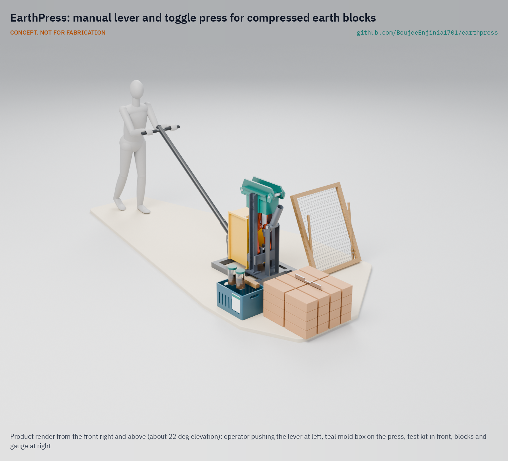

# EarthPress

     

**Area:** Sustainable Housing · **TRL:** 3 of 9 (proof of concept on paper) · **Prototype budget:** about $500 USD · **Difficulty:** 3 of 5

A manual compressed earth block press with a lever and toggle linkage, producing stabilized soil blocks for low-carbon walls, with a simple soil test kit to choose mixes.

[Exploded render](media/render-exploded.png) · [Detail render](media/render-detail.png) · [Interactive 3D model](media/viewer.html) · [Concept blueprint (PDF)](media/concept-blueprint.pdf) · [General arrangement (PDF)](cad/drawings/EPR-DWG-001.pdf) · [Sizing note](docs/04-calcs/01-sizing.md) · [Decisions](docs/decisions/0002-recommendations-accepted.md) · [Review note](docs/REVIEW.md)

## Concept rationale

Compressed stabilized earth blocks turn the soil on a building site into walling with a fraction of the energy of fired brick, but only if someone has a press. A manual lever and toggle press needs no fuel, power or hydraulics, can be welded from stock steel sections, and puts block making in the hands of the builder instead of a factory. The toggle suits the job because soil gets stiffer as it compacts, and a toggle's force ratio rises sharply at the end of its stroke, exactly where the force is needed.

EarthPress is open hardware so that a local welder can build, repair and adapt it without license fees or a distant supplier, and so that the soil test kit and mix guidance travel with it. The press and soil kit come to about $490 in parts (indicative), well below the thousands of dollars of hydraulic designs, and garage-buildable with a stick welder, grinder and drill press.

## Burning platform

Buildings and construction account for about 32 % of global energy use and 34 % of global CO2 emissions ([UNEP, 2025](https://www.unep.org/resources/report/global-status-report-buildings-and-construction-20242025)), and cement alone for around 8 % of global CO2 ([Chatham House, 2018](https://www.chathamhouse.org/2018/06/making-concrete-change-innovation-low-carbon-cement-and-concrete)). At the same time UN-Habitat estimates that about 3 billion people will need adequate housing by 2030, about 96,000 new affordable homes every day ([UN-Habitat](https://unhabitat.org/topic/housing)).

Meeting that demand with fired brick and cement block would lock in large emissions. Cement-stabilized earth blocks embody about 49 kg CO2/m³ against about 643 kg CO2/m³ for locally fired bricks ([Auroville Earth Institute](https://www.earth-auroville.com/compressed_stabilised_earth_block_en.php)), so the walls of a small house (about 7 m³ of blockwork) would avoid roughly 4.2 t of CO2 (estimate from EPR-CAL-001, excluding mortar and transport).

## Where it could be used

### By industry

| Industry | Use |
| --- | --- |
| Self-build and affordable housing | Families and cooperatives make walling for one- and two-room houses from site soil |
| Small construction enterprises | A block yard sells stabilized blocks to local builders as a business |
| Humanitarian and reconstruction programs | NGOs train masons and build schools, clinics and transitional-to-permanent housing |
| Agriculture | Farm stores, grain stores, animal shelters and boundary walls |
| Vocational education | Technical colleges teach earth building, soil testing and press fabrication |
| Low-carbon architecture in high-income countries | Garden walls, studios and small buildings where earthen codes allow CEB |

### By country or region

| Country or region | Why it matters there |
| --- | --- |
| Sub-Saharan Africa | 265 million people lived in slums in 2022, with an estimated 360 million more by 2030 if trends persist ([UN SDG Report 2024](https://unstats.un.org/sdgs/report/2024/Goal-11/)); soil is abundant and cement is costly |
| India and South Asia | Central and Southern Asia had 334 million slum dwellers in 2022 ([UN SDG Report 2024](https://unstats.un.org/sdgs/report/2024/Goal-11/)); India is home to the Auroville Earth Institute, a long-running center of CSEB practice, and fired-brick kilns are widespread |
| Eastern and South-Eastern Asia | The largest slum population, 362 million people in 2022 ([UN SDG Report 2024](https://unstats.un.org/sdgs/report/2024/Goal-11/)) |
| Colombia and Latin America | Soil-cement blocks were used in Colombian projects by the 1940s, and the CINVA-Ram manual press, designed at CINVA in Bogotá in 1956, spread to Bolivia, Brazil, Peru and beyond ([Botti, *Frontiers of Architectural Research*, 2023](https://www.sciencedirect.com/science/article/pii/S2095263523000584)) |
| United States (New Mexico) | The 2021 New Mexico Earthen Building Materials Code covers CEB and requires 300 psi (about 2.1 MPa) compressive strength ([14.7.4 NMAC](https://www.srca.nm.gov/parts/title14/14.007.0004.html)) |

## What sparked the idea

The starting point was the CINVA-Ram, the steel lever press that Chilean engineer Raúl Ramírez designed in 1956 at the Inter-American Housing Center (CINVA) in Bogotá and patented in 1958. Self-help housing programs then carried it as far as Ghana and South Vietnam, showing that one hand-operated press could put earth-block walls within reach of families building their own homes ([Botti, *Frontiers of Architectural Research*, 2023](https://www.sciencedirect.com/science/article/pii/S2095263523000584)). Seventy years on, that pattern still has no open, dimensioned and calculated successor that a local welder can build, while the best-documented open press, the Open Source Ecology CEB Press, is hydraulic and costs $3,000 to $6,500 in materials ([OSE wiki](https://wiki.opensourceecology.org/wiki/CEB_Press)). EarthPress sets out to update the CINVA-Ram idea with a toggle sized by calculation, a soil test kit and open drawings.

## Problem

Fired bricks and cement blocks carry high embodied carbon and cost; compressed earth blocks are proven but good presses are expensive or hard to source. Design with, not for: requirements must come from co-design sessions with builders and masons through a local partner (see [docs/01-problem.md](docs/01-problem.md)).

## Concept

A manual compressed earth block press with a lever and toggle linkage, producing stabilized soil blocks for low-carbon walls, with a simple soil test kit to choose mixes. A 1.7 m lever drives a toggle under the piston to compact a weighed fill of moist, sieved soil into a 290 x 140 x 90 mm block at 2 MPa (81 kN); the same lever, moved to an eject socket, pushes the block out. The TRL 3 sizing note (EPR-CAL-001) gives a force ratio of 173:1 at the stop and a peak pull of 668 N, so two people share the lever on a T-handle. Estimates: about 296 blocks a day with a crew of four, a press of about 187 kg in pieces of 37 kg or less, and about $488 in parts, within the $500 budget. With the targets Amish accepted on 2026-09-25 ([EPR-DDR-002](docs/decisions/0002-recommendations-accepted.md)), no requirement is not met on paper; R2 (pressure) and R4 (output) are at risk. See the [review note](docs/REVIEW.md).

Full design precis: [docs/02-concept.md](docs/02-concept.md)

## Key components

1. Frame on skids, in two bolted pieces
2. Steel mold box
3. Ribbed lid with hinge and latch
4. Piston and push rod
5. Toggle links, pins and bushes
6. Lever, crank hub and T-handle (removable)
7. Eject lever, lever catch and end pawl
8. Soil sieve, 5 mm mesh
9. Soil test kit
10. Block gauge

The priced bill of materials is in [bom/bom.csv](bom/bom.csv) (13 lines; lines 11 to 13 are hardware, consumables and the linkage guard). Numbers match the [exploded view](media/exploded.png). Geometry comes from the parametric model in [cad/src/model.py](cad/src/model.py), with STEP and STL exports in `cad/step` and `cad/stl`.

## Safety

> High lever forces: the piston applies 81 kN at 2 MPa and up to 173 kN if two people pull hard at the stop. Keep hands clear of the mold, linkage and eject fork, engage the end pawl before letting go (the lever kicks back with about 47 J), and never unlatch the lid until the lever is back on its rest stop. Cement burns skin and eyes, and sieving dry soil raises silica dust: wear gloves, eye protection and a respirator. Use two-person lifting for the press parts (up to 37 kg each). Blocks are not certified; structural use needs an engineer and block tests under the local code. See the safety section of [docs/02-concept.md](docs/02-concept.md).

## Repository layout

| Folder | Contents |
| --- | --- |
| `docs/` | Problem, concept, requirements, calculations and design decisions |
| `cad/src/` | build123d Python source, the source of truth for all geometry |
| `cad/step/`, `cad/stl/` | Exported models for FreeCAD, other CAD tools and printing |
| `cad/drawings/` | 2D sketches and dimensioned drawings |
| `bom/` | Bill of materials |
| `electronics/` | KiCad schematics and PCB layouts |
| `firmware/` | Microcontroller code |
| `media/` | Renders, perspectives and photos |
| `build-log/` | Dated prototyping notes |

## Documentation

Controlled documents follow the portfolio [documentation standard](.kit/STANDARDS.md). Each carries a document ID (EPR-PRC-001 for the precis), a version and a revision history. Branded PDFs are built with `python .kit/render.py` and attached to GitHub Releases when a document is tagged, for example `EPR-PRC-001/v1.0`.

## Credits

Designed by Amish Chadha, with contributions from Ashok Kumar Chadha. See [CONTRIBUTORS.md](CONTRIBUTORS.md) for roles. To cite this design, use [CITATION.cff](CITATION.cff) (GitHub shows it as "Cite this repository").

AI assistance (Claude) was used to accelerate concept renders, prototype documentation and first-pass sizing calculations. Design direction and all decisions are Amish Chadha's, recorded in this repository's decision records (`docs/decisions/`).

## Licenses

- **Hardware** (CAD, drawings, BOM, electronics): [CERN-OHL-S v2](LICENSE)
- **Software** (firmware, scripts, notebooks): [MIT](LICENSE-SOFTWARE)

A project of the [Design Molecule](https://designmolecule.com) lab.
