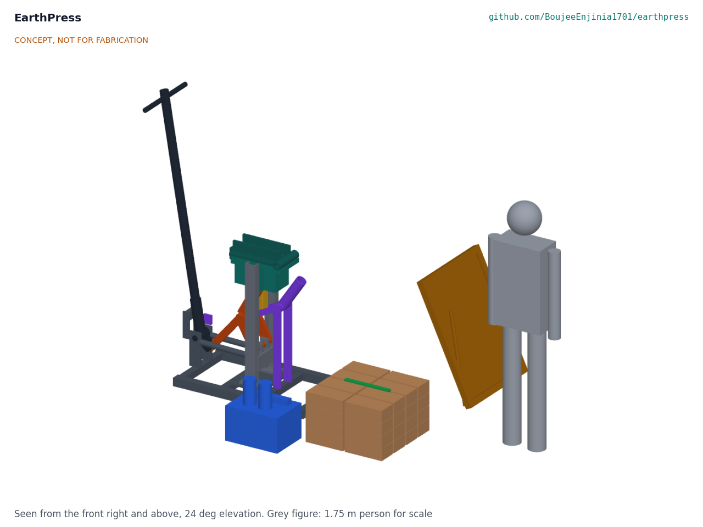
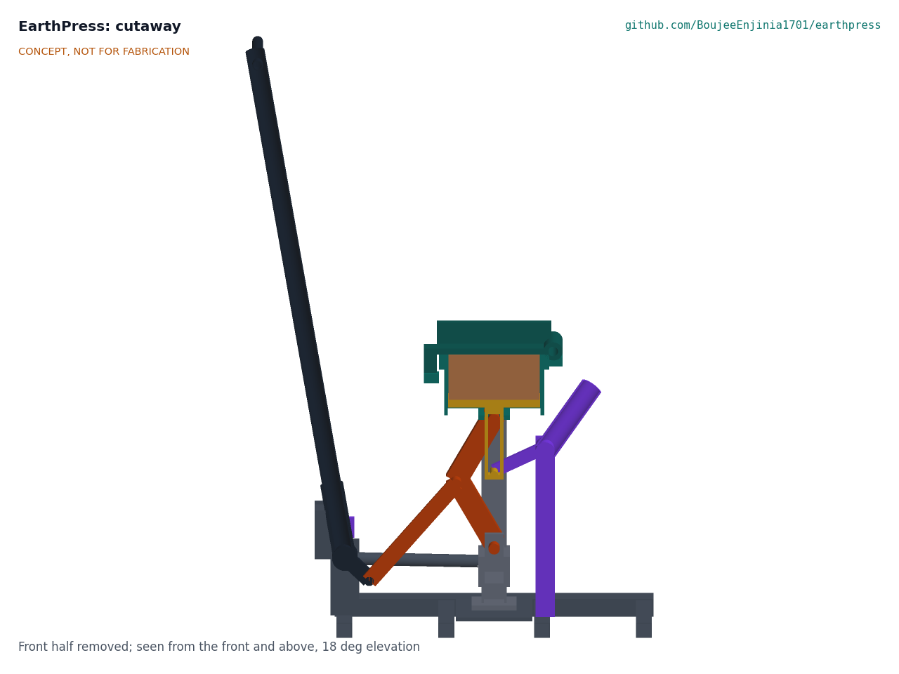
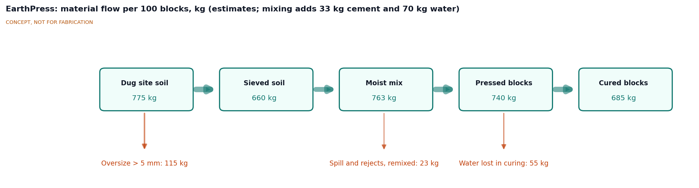
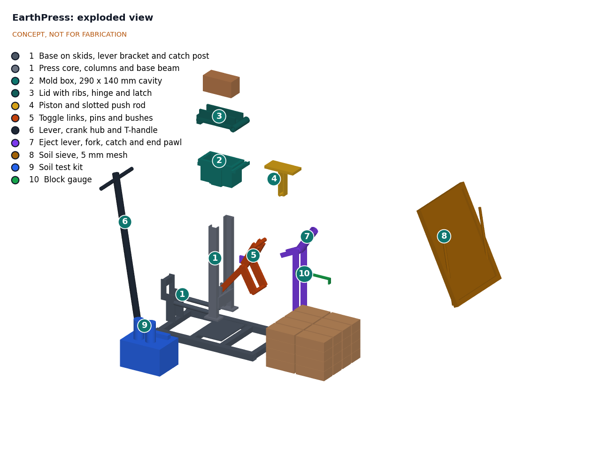

# EarthPress design precis

## Summary

EarthPress is a manual press, welded from common steel sections, that compacts moist, sieved and cement-stabilized site soil into 290 x 140 x 90 mm blocks with a 1.7 m lever driving a toggle linkage under the mold. The TRL 3 calculation (EPR-CAL-001) shows that the linkage reaches the 81.2 kN needed for 2 MPa with a force ratio of 173:1 at the stop, but that the peak pull is 668 N, so **two people share the lever on a T-handle**. Each fill is **weighed** to within about 200 g, because the pressure reached at the stop is sensitive to fill mass. The block is ejected with the same lever moved to a separate eject socket. A crew of four could make about 296 blocks a day (8.9 m² of 140 mm wall). Made buildable on 2026-10-01 (EPR-DDR-003), the press weighs about 200 kg, its heaviest piece 45 kg, and the press and kit cost about $523 in parts. Against the targets Amish accepted on 2026-09-25 (EPR-DDR-002), R5 (334 N per operator) is met on paper, R7 is met on paper against the 200 kg total (including the guard and bolts) that Amish set on 2026-10-02 (EPR-DEC-001), R13 is over its value-engineering target (estimated $523 against a $500 target, USD 23 over), and R2 and R4 are at risk. All values are estimates.

*Figure 1. EarthPress at the start of the stroke, with its soil sieve, test kit, a stack of blocks with the block gauge, and a 1.75 m person for scale. Concept model, not for fabrication.*

## How it works

1. **Test.** The soil test kit screens site soil with a jar sedimentation test (sand, silt and clay fractions), a shrinkage box (linear shrinkage), and ribbon and drop tests. A printed chart turns the results into go or no-go and a starting cement content, usually 5 % by dry mass, following Auroville Earth Institute practice ([Auroville Earth Institute](https://www.earth-auroville.com/compressed_stabilised_earth_block_en.php)).
2. **Sieve and mix.** The crew throws dry soil through a 5 mm mesh sieve leaning on a prop, measures soil and cement by bucket, mixes them dry, then adds about 10 % water until a squeezed ball holds its shape and breaks cleanly when dropped.
3. **Weigh and fill.** With the lever on its rest stop, held there by the rest catch, and the lid open, the piston sits at the bottom of its stroke. The operator weighs every fill on the 10 kg scale (a calibrated scoop is allowed only for a soil whose scoop-to-mass scatter has been measured within the 0 to 2.7 % fill window) to the target on the chart (about 7.74 kg for the reference soil, +1.3 % ± 100 g), tips it into the 290 x 140 mm mold, levels it about 150 mm deep, closes the lid and pushes the latch pin in.
4. **Press.** One operator lifts the rest catch; two people pull the T-handle down from about 1.9 m to about 0.86 m. A 107 mm crank on the lever hub pushes a 420 mm connecting link against the knee of the toggle, which straightens from 29° to 6° from vertical and lifts the piston 60 mm. The force ratio climbs from about 15:1 to 173:1, so the force arrives where the soil is stiffest; the peak pull, 668 N in total, comes about 3 mm before the crank stop, at waist height. The end pawl drops in under the crank pin at the stop.
5. **Eject.** The operators hold the lever, lift the pawl and return the lever to its rest stop, where the catch drops in; this unloads the block. The latch pin is pulled and the lid swung open. The operator moves the lever to the eject socket on the +X side and pulls down: the round nose of the seesaw's arm lifts the push rod 160 mm, the rod rising past the toggle pin in its 200 mm slot, which pushes the block flush with the rim at about 470 N on the grip. The block is lifted off, checked with the block gauge and stacked in shade.
6. **Cure.** Blocks are kept damp under cover for about four weeks to let the cement hydrate, then air dried before use.

*Figure 2. Section through the mold and linkage at the start of the stroke: loose soil (brown) above the piston and slotted push rod (yellow), toggle links (orange), lever hub, crank and connecting link on the left, eject seesaw (purple) on the right.*

*Figure 3. Material flow per 100 blocks, in kg (EPR-CAL-001 section 10). All values are estimates for a soil with 15 % oversize, 5 % cement and 10 % water.*

## Main components

Numbers match the exploded view (Figure 4) and `bom/bom.csv`. The general arrangement is drawing EPR-DWG-001 (`cad/drawings/EPR-DWG-001.pdf`).

*Table 1. Components.*

| # | Component | Choice | Notes |
| --- | --- | --- | --- |
| 1 | Frame, in two bolted pieces | Base: 60 x 60 x 3 mm tube skids 1.0 m long, 50 x 50 mm cross tubes flush with the skids, 12 mm base plate, shaped lever bracket plates with a rest stop bar, tie tubes bolted to the core, eject posts. Core: two UPN 80 columns, webs toward the mold, with pin access holes, and a base beam of two 20 x 100 mm plates with lugs carrying the toggle base pin | The press force closes through the core and mold; the base only carries weight and the lever reaction. 45.0 and 28.2 kg |
| 2 | Mold box | 12 mm plate round a 290 x 140 x 200 mm cavity, 16 x 50 mm belt round the top, side flanges tapped for eight M16 8.8 bolts through the column webs, hinge and latch lugs | 30.4 kg |
| 3 | Lid with hinge and latch | 20 mm plate with two 20 x 70 mm ribs cut long as ears for the 30 mm hinge pin and the 30 mm latch pin | Rated for 173 kN; 27.0 kg with pins |
| 4 | Piston and push rod | 25 mm plate with two end skirts on a 60 mm square rod with a 200 mm lost-motion slot | Clearance about 1 mm per side in the mold |
| 5 | Toggle linkage | Four 28 x 70 mm round-ended links, 245 mm between centers; 24 x 50 mm connecting link, 420 mm; three 35 mm C45 pins in case-hardened steel bushes with grease nipples and felt or rubber dust seals at the bush faces, with spacers | Crank stop at 6° limits the force to 173 kN |
| 6 | Lever, crank hub and T-handle | 1.7 m of 2 in schedule 40 pipe in a socket on a hub with a 107 mm crank; pivot at 266 mm height, 468 mm from the piston axis; 0.5 m T-handle | Removable; the same pipe fits the eject socket |
| 7 | Eject lever, rest catch and end pawl | Seesaw with a central arm whose round nose lifts the push rod, 160 mm from its pivot on the +X side; spring catch and pawl that hold the crank pin at the start and the end of the stroke | Eject ratio 10.3:1 |
| 8 | Soil sieve | 5 mm welded mesh in a 700 x 900 mm timber frame on a prop | Removes stones and clods |
| 9 | Soil test kit | Two 1 L clear jars, a 600 x 40 x 40 mm shrinkage box, measuring buckets, 10 kg scale with 50 g divisions, printed chart | Field tests only (EPR-DDR-001 item 7) |
| 10 | Block gauge | Bar with legs 292 mm apart and a 93 mm notch, for length and height | Checks every block |

BOM lines 11 to 13 (hardware and paint, consumables, and an expanded-metal guard over the crank, connecting link and knee) have no callout.

*Figure 4. Exploded view with callouts matching the BOM. Loose soil and the block stack are context only.*

## Key numbers

All values are estimates from EPR-CAL-001, where the assumptions are stated.

*Table 2. Key numbers.*

| Quantity | Value | Basis |
| --- | --- | --- |
| Block force for 2 MPa | 81.2 kN (8.3 tonne-force) | 2 MPa x 0.0406 m² |
| Block volume and mass | 3.65 L; 6.94 kg dry, 7.64 kg moist | Dry density 1,900 kg/m³ (assumed) |
| Force ratio | 14.8:1 at the start, 20.0:1 at 30 mm, 173:1 at the stop | Toggle 29.3° to 6.0°, lever arc 59.2° |
| Peak pull at the grip | 668 N (334 N each for two); 571 to 809 N for stiffer or softer soil; the operating chart uses the softer soil (809 N, 405 N each) until partner soils are measured | Soil pressure rising tenfold over the last 14 mm (assumed) |
| One operator at 500 N | Stalls at 0.53 MPa | The peak comes before the stop |
| Compaction work | 494 J (353 to 705 J) | Same soil law |
| Fill window for 2 MPa at the stop | 0 to +2.7 % of nominal (0 to 206 g) | Two operators |
| Design load for the structure | 173 kN (4.26 MPa on the block) | 1,000 N at the grip at the stop |
| Lowest safety factor at 173 kN | 1.13 (bush bearing); lid 1.61, base beam 1.60, lever 1.57 | EPR-CAL-001 Table 5 |
| Kickback energy if released at the stop | 47 J | 1 mm soil rebound plus column stretch |
| Eject force and grip force | 4.84 kN; 470 N | 0.1 MPa residual wall pressure, friction 0.6 (assumed) |
| Output | 296 blocks per day, crew of four; 8.9 m² of wall | 85 s cycle (assumed) |
| Small house, 50.5 m² of wall | 1,683 blocks, 5.7 press days, 556 kg cement (11.1 bags) | 22 m perimeter, 2.7 m walls, 15 % openings |
| Embodied CO2 of that wall | 0.35 t as CSEB against 4.55 t as fired brick (7.6 %) | 49 and 643 kg CO2/m³ ([Auroville Earth Institute](https://www.earth-auroville.com/compressed_stabilised_earth_block_en.php)); excludes mortar and transport |
| Press mass | 199.996 kg with guard, bolts and dust seals; heaviest piece 45.0 kg | Model volumes at 7,850 kg/m³ |
| Parts cost | $523 (indicative; USD 23 over the $500 value-engineering target; includes $3 of dust seals) | `bom/bom.csv` |

## Key design choices

All of these choices were decided by Amish on 2026-09-25: go with recommendation (EPR-DDR-001, EPR-DDR-002).

- **Bottom piston with a toggle and one lever**, following the CINVA-Ram pattern rather than a screw, a bottle jack or a top-down ram. It needs no hydraulic parts and a welder can build and repair it.
- **Flat 290 x 140 x 90 mm block**, the module used by the Auroville Earth Institute. Interlocking molds could follow as inserts.
- **2 MPa compaction target**, the low end of CSEB practice.
- **Cement stabilization at 5 % by default**, with lime as a documented option for clay-rich soils or where cement is scarce, with its own mix chart and a longer curing period; the press and its dwell are the same (decided 2026-10-02).
- **Plain 12 mm mold walls** for the prototype; their wear is measured against R8, and bolt-on hardened liners are designed only if the measured rate would not last 50,000 sandy blocks (decided 2026-10-02).
- **Field soil tests only**, with no lab equipment.
- **Bolted frame and mold with a 12 mm base plate**, so the press splits into pieces of 45 kg or less.
- **Longer arc from a low pivot**: the lever starts nearly upright, which gives 59° of arc with the grip between 0.86 and 1.89 m. Raising the pivot to 800 mm for a 100° arc, as proposed at TRL 2, would take the grip below the ground.
- **Two operators on a T-handle**, since one person at 500 N stalls at 0.53 MPa.
- **Separate eject seesaw with a lost-motion slot**, because a toggle ending near straight cannot lift the piston another 90 mm.
- **Crank stop at the design end angle and a weighed fill**, which caps the force at 173 kN and fixes the block height at 90 mm.

## Safety

> **Safety:** The press applies 81 kN (over 8 tonne-force) at the piston, and up to 173 kN if two people pull hard at the stop. Keep hands out of the mold, the linkage and the eject arm while anyone is on a lever. Only the people on the lever touch it, and only after calling "clear". Keep the linkage guard in place.

> **Safety:** Released at the end of the stroke, the lever kicks back with about 47 J. Engage the end pawl before letting go, return the lever to its rest stop under control, keep heads out of the lever arc and never stand on the lever.

> **Safety:** Never unlatch the lid while the lever is loaded. Return the lever to the rest stop first. The lid and latch are sized for 173 kN, but a worn latch or a missing pin can throw the lid and soil upward.

> **Safety:** Portland cement is alkaline and can burn skin and eyes. Wear gloves, long sleeves and eye protection when mixing. Sieving dry soil raises dust that may contain respirable crystalline silica; sieve damp soil where possible, work upwind and wear an FFP2 or N95 respirator.

> **Safety:** A moist block weighs about 7.6 kg, the lid 27 kg on its hinge and the press 200 kg. Lift blocks close to the body, rotate tasks in the crew, and move the press dismantled, two people to each piece.

> **Safety:** Blocks made by EarthPress are not certified. Walls in seismic zones, multi-storey walls and any building that needs a permit require a structural design and block tests by a qualified engineer under the local building code.

> **Safety:** Building the press involves welding, grinding and cutting. Use welding PPE, guard grinders and work away from flammables.

## Open questions

Open decisions and questions are kept in the design decisions register, `docs/06-design-decisions.md` (EPR-DEC-001).
