# EarthPress prototype build plan

**Plan, not yet built.** How to build the first proof-of-concept prototype, component by component. Building and testing to it is TRL 4 work. Decisions still to be made are kept in the design decisions register ([docs/06-design-decisions.md](06-design-decisions.md)), not here.

## 1. What you are building

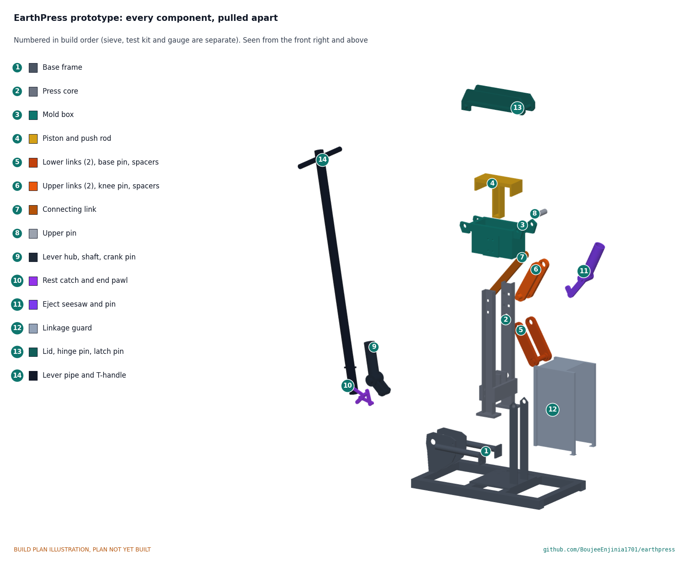

*Figure 1. Every component pulled apart and numbered in build order. The soil sieve, test kit and block gauge are separate and are made last.*

The prototype is one EarthPress: a welded steel press about 1.3 m long, 0.6 m wide and 1 m to the mold rim, with a removable 1.7 m lever, plus its soil sieve, soil test kit and block gauge. Figure 1 shows the 14 press components in the order you make or fit them. Thirteen are made in a welding shop: the base frame and the press core (two welded pieces that bolt together), the mold box, the lid, the piston with its push rod, four toggle links, the connecting link, the lever hub, the rest catch and end pawl, the eject seesaw, the linkage guard and the lever pipe. Bought parts are the turned pins, shaft and bushes, spacer tubes, bolts, springs and the test kit. The work is sawing, flame or plasma cutting, drilling, tapping, stick welding and grinding of mild steel plate, channel, tube and pipe. The parts cost about $523 from the bill of materials, against a value-engineering target of $500.

> **Safety:** The finished press puts 81 kN (over 8 tonne-force) on the block, and up to 173 kN if two people pull hard at the end of the stroke. Keep hands out of the mold, the linkage and the eject arm whenever anyone is on the lever. Building it involves welding, grinding and cutting: wear welding PPE, guard the grinder, and work away from anything that burns. The press weighs about 200 kg; its heaviest piece, the base frame, is 45 kg: lift every piece with two people.

## 2. What changed to make it buildable

The concept showed what the press does; some of its parts could not be made or fixed as drawn. Each change below keeps what the press does, and all of them are recorded in decision record EPR-DDR-003, accepted by Amish on 2026-10-02.

*Table 1. Changes from the concept.*

| Component | The concept had | The buildable design has | Why |
| --- | --- | --- | --- |
| Base frame | A base plate resting on nothing; cross tubes below the skid tops | Cross tubes flush with the skid tops, two of them under the base plate; a larger plate that also carries the eject posts (Figure 2) | The plate sits on, and is welded to, two tubes |
| Columns | Open side of the channel toward the mold, so the mold bolts had no room for a nut | Webs toward the mold; bolts from inside the open channel into threads tapped in the mold's flanges (Figure 8) | Every bolt can be reached with a socket |
| Base beam and lugs | Beam plates overlapping the columns; lugs floating above the beam | Beam plates on the outside of the column flanges; lugs welded between them (Figure 12) | One welded clevis for the base pin |
| Piston | A guide strap under the mold, in the path of the links at the end of the stroke | Strap removed; two end skirts under the piston keep it square in the mold (Figure 9) | Nothing in the links' path |
| Toggle pins | Pins that could not pass the column webs; links free to slide along their pins | Access holes in one column for the base pin and the upper pin; spacer tubes on the pins (Figures 10 and 12) | The pins can be fitted, and every link is located |
| Links | Bars ending at the pin centres | Round ends and pressed-in bushes on every link, with a felt or rubber dust seal washer on each outer link face (Figure 11) | Metal round every hole; grit kept out of the bushes |
| Lid hinge and latch | A hinge knuckle cutting into the mold; a latch hook that sat above its keeper | Lid ribs cut long as ears; a 30 mm hinge pin and a 30 mm latch pin through lugs on the mold (Figures 23 and 24) | Each pin works in double shear and holds the full force |
| Rest stop and end pawl | A rest bar in the lever's path; a pawl that could not reach the lever | A rest stop bar under the crank, and a spring catch and pawl that drop onto the crank pin at the start and the end of the stroke (Figures 16 and 18) | The lever cannot fall into the stroke or kick back |
| Eject lever | A fork that crossed the links at the end of the stroke | One central cranked arm whose round nose lifts the push rod's foot (Figure 20) | The arm stays inside the rod's width |
| Ties | Tubes in the crank pin's path | Tubes moved out, welded along the bracket plates, bolted to the beam (Figure 6) | The crank pin clears them |
| Linkage guard | In the parts list only | Expanded metal on an angle frame, bolted to the base and the bracket (Figure 21) | Covers the scissor points |
| Block gauge | A placeholder | Legs 292 mm apart and a 93 mm notch (Figure 26) | Checks the longest and tallest good block |

## 3. Making the components

Make and check each component before the assembly step that needs it. Sizes are in millimetres. "Front" is the side you see in Figure 1, "left" is the lever end and "right" the eject end; "+Y" is the side away from you. Workshop tolerance is 1 mm unless a step says otherwise; drawings do not carry tolerances before TRL 4. Weld with a stick welder, fillet welds the size of the thinner part, and clean off the slag before painting.

### 3.1 Base frame

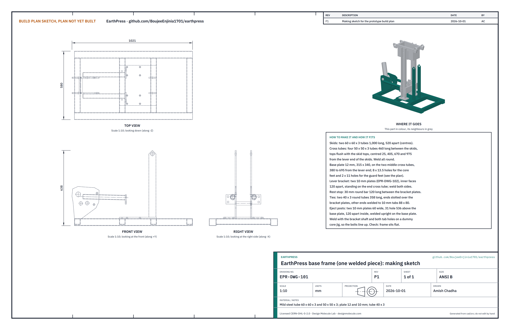

*Figure 2. Base frame making sketch (EPR-DWG-101).*

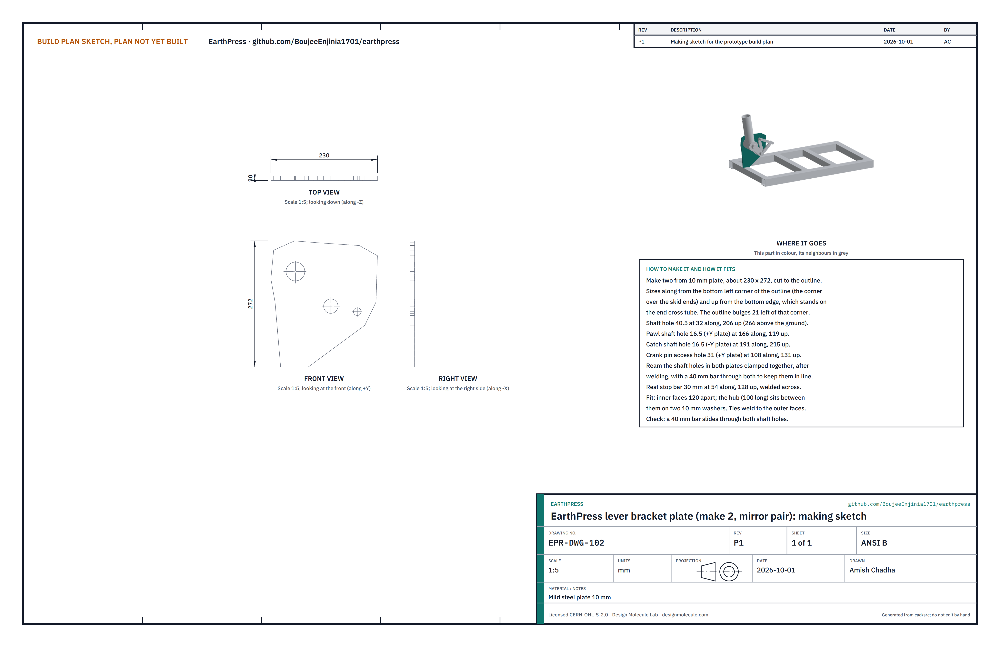

*Figure 3. Lever bracket plate making sketch (EPR-DWG-102).*

**What it is and what it is made from.** The ladder frame the press stands on, with the lever bracket at the left end and the eject posts at the right: one welded piece of about 45 kg. Mild steel tube 60 x 60 x 3 and 50 x 50 x 3, plate 12 and 10 mm, round tube 40 x 3.

**How to make it.**

1. Cut two skids of 60 x 60 x 3 tube 1,000 long and four cross tubes of 50 x 50 x 3 tube 460 long.
2. Lay the skids on a flat table, 520 apart between centres. Fit the cross tubes between them with their tops flush with the skid tops, centred 25, 405, 670 and 975 from the left ends. Check the diagonals are equal, then weld all round.
3. Cut the base plate, 12 mm, 315 x 340. Drill eight 13.5 holes for the core feet (on a 110 x 70 pattern each side, centred 120 either side of the middle) and two 11 holes for the guard feet, as Figure 2 shows. Weld the plate onto the two middle cross tubes, 380 to 695 from the left ends.
4. Cut the two lever bracket plates from 10 mm plate to the outline of Figure 3 (a mirror pair). Drill the shaft hole 40.5, the pawl shaft hole 16.5 and the 31 crank pin access hole in the +Y plate, and the catch shaft hole 16.5 in the -Y plate.
5. Stand the bracket plates on the left cross tube, inner faces 120 apart, with a 40 mm bar through both shaft holes to hold them in line. Weld both sides. Weld the 30 mm rest stop bar, 120 long, across between them at the position in Figure 3, and slide on its rubber sleeve after painting.
6. Cut two 40 x 3 round tubes 358 long for the ties. Slot one end of each 10 mm wide and 40 deep so it straddles a bracket plate, and weld the other end square to a 10 mm tab 88 x 80. Drill each tab with two 13.5 holes, as Figure 6 shows.
7. Bolt the two tabs to the press core (section 3.2) as a jig, slot the tie tubes over the bracket plates, check the core stands square on the base plate, and weld the ties along the outside faces of the bracket plates. Unbolt the core.
8. Cut the two eject posts from 10 mm plate, 60 wide, with a 31 hole 536 above the bottom edge and a pointed top. Weld them upright on the base plate, 120 apart inside, centred 160 to the right of the press's centre line.

**How it fits the parts next to it.** The core's feet bolt to the base plate (Figure 5); the tie tabs bolt to the core's beam (Figure 6); the hub shaft runs through the bracket plates (Figure 16); the eject pivot pin runs through the posts (Figure 20).

**Check before moving on.** The frame sits flat on a flat floor without rocking; a 40 mm bar slides through both bracket shaft holes; the two post holes line up.

### 3.2 Press core

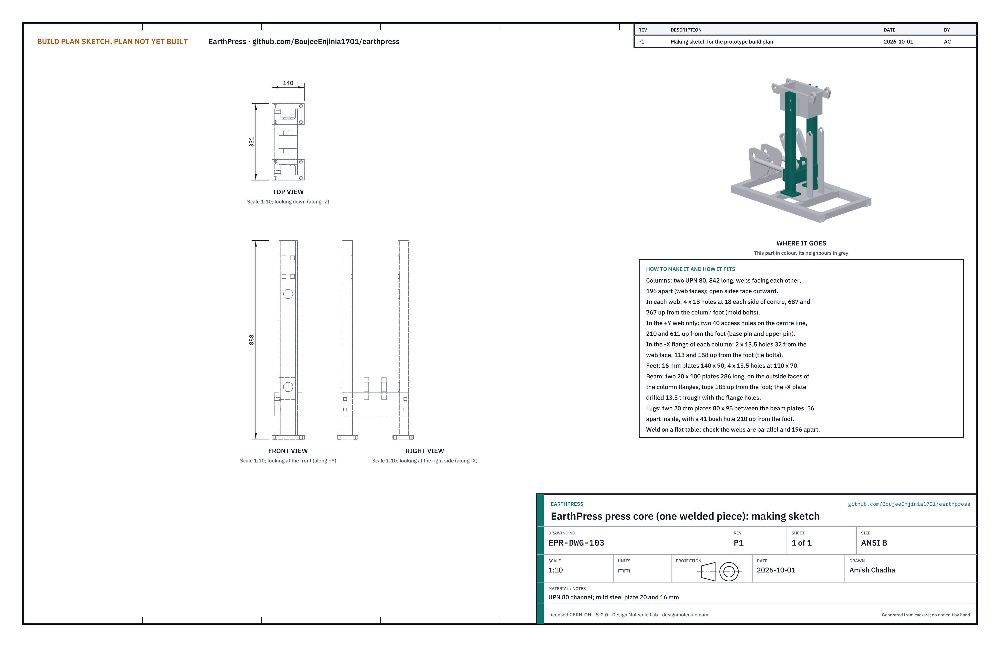

*Figure 4. Press core making sketch (EPR-DWG-103).*

**What it is and what it is made from.** The two columns that carry the mold, joined at the bottom by the base beam that carries the base pin: one welded piece of about 28 kg. UPN 80 channel, plate 20 and 16 mm.

**How to make it.**

1. Cut two UPN 80 columns 842 long, ends square.
2. In each web, drill four 18 holes for the mold bolts, 18 each side of the centre line, 687 and 767 up from the bottom end.
3. In one column only (the +Y column), drill two 40 access holes on the web's centre line, 210 and 611 up from the bottom end.
4. In one flange of each column (the left flange), drill two 13.5 holes 32 from the web face, 113 and 158 up from the bottom end, for the tie bolts.
5. Cut two feet, 16 mm plate 140 x 90, each drilled with four 13.5 holes on a 110 x 70 pattern. Weld a column upright on the middle of each foot, its web over the foot's long centre line.
6. Stand the two columns on a flat table with their webs facing each other, 196 apart between the web faces and square to each other.
7. Cut two beam plates, 20 x 100 x 286. Clamp one to the outside faces of the left flanges, top edge 185 above the feet, and drill through the 13.5 tie bolt holes. Weld both beam plates to the outside faces of the flanges.
8. Cut two lugs, 20 mm plate 80 x 95, with a 41 hole 55 from the top edge. Fit them between the beam plates, 56 apart inside, with a 41 bar through both holes to hold them in line, 210 above the feet, and weld them to both beam plates.

**How it fits the parts next to it.**

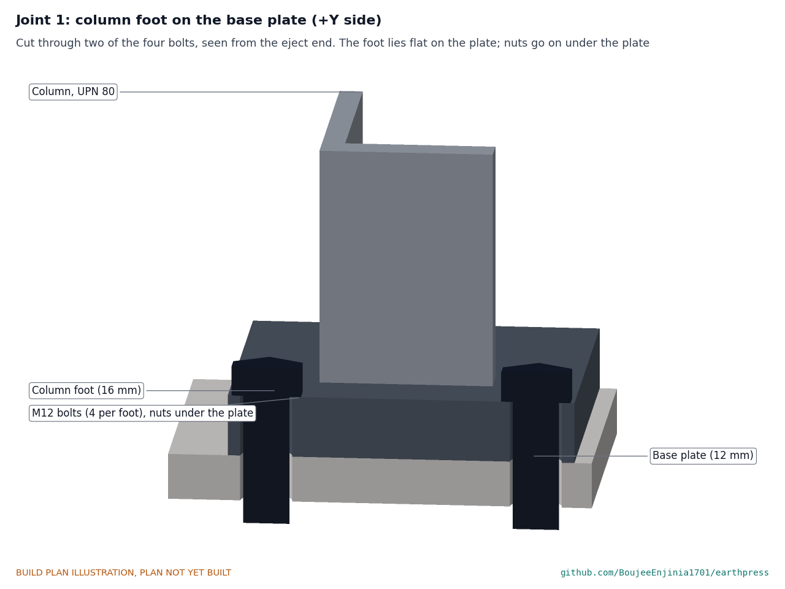

*Figure 5. Joint 1: each foot lies flat on the base plate, held by four M12 bolts with the nuts under the plate.*

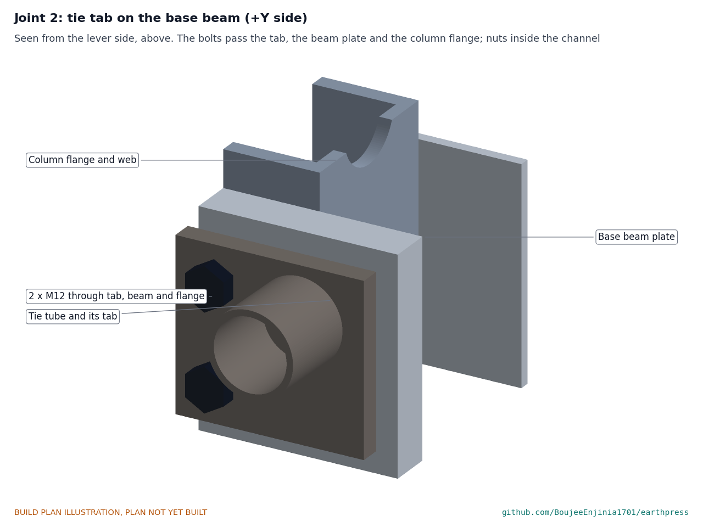

*Figure 6. Joint 2: two M12 bolts pass through the tie's tab, the beam plate and the column flange; the nuts go on inside the open channel.*

**Check before moving on.** The webs are parallel and 196 apart (plus 0.5, minus 0) at top and bottom; a 41 bar slides through both lugs.

### 3.3 Mold box

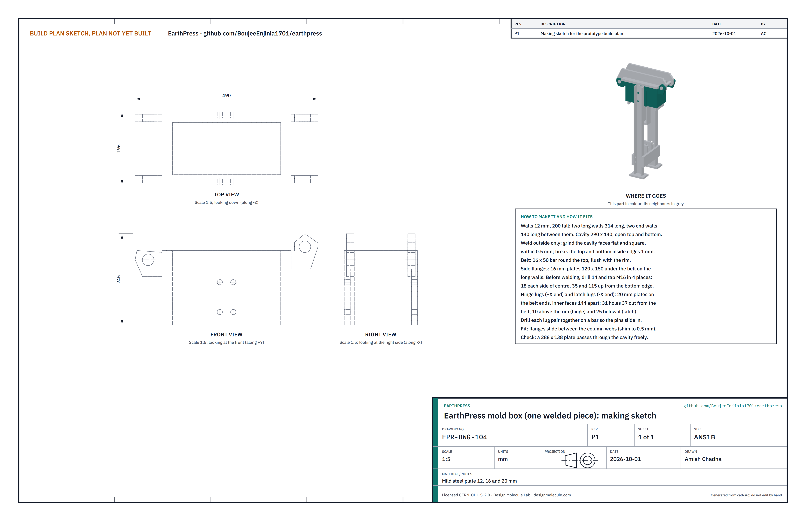

*Figure 7. Mold box making sketch (EPR-DWG-104).*

**What it is and what it is made from.** The open box the soil is pressed in, with a stiffening belt round its top, two side flanges that bolt to the columns, and lugs for the lid's hinge and latch pins: one welded piece of about 30 kg. Mild steel plate 12, 16 and 20 mm, and 16 x 50 bar.

**How to make it.**

1. Cut two long walls 314 x 200 and two end walls 140 x 200 from 12 mm plate. Mark the inside faces.
2. Tack the box together on a flat plate with the end walls between the long walls, check the cavity is 290 x 140 and square, and weld outside only.
3. Grind the four inside faces flat and square within 0.5 mm and break the inside edges at top and bottom by 1 mm.
4. Cut two side flanges, 16 mm plate 120 x 150. Before welding, drill 14 and tap M16 in four places: 18 each side of the centre, 35 and 115 up from the bottom edge.
5. Weld the 16 x 50 belt round the top, flush with the rim, then the flanges centred on the long walls under the belt.
6. Cut four lugs from 20 mm plate (Figure 7). Drill each pair together with a 31 drill on one bar. Weld the hinge lugs to the right end of the belt and the latch lugs to the left end, inner faces 144 apart, with a 30 bar through each pair so the holes stay in line: the hinge holes 37 out from the belt and 10 above the rim, the latch holes 37 out and 25 below the rim.

**How it fits the parts next to it.**

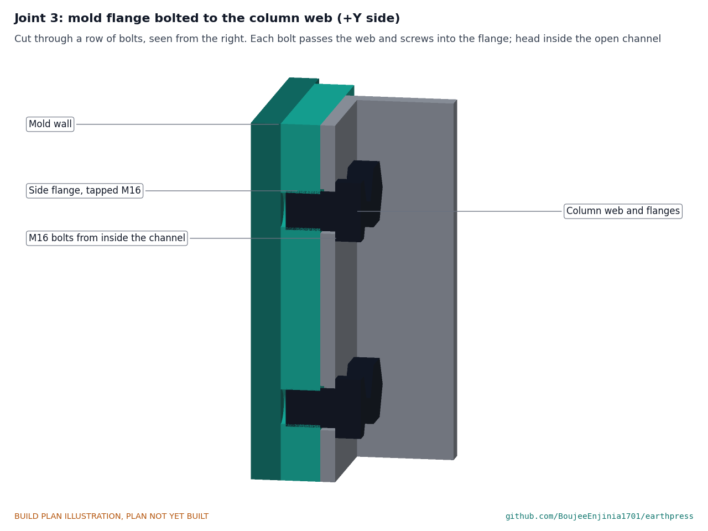

*Figure 8. Joint 3: the flange lies flat against the column web; four M16 bolts go through the web from inside the channel into the tapped flange.*

The flanges slide between the two column webs; shim to a gap of 0.5 mm or less. The rim sits 940 above the ground.

**Check before moving on.** A 288 x 138 plate passes through the cavity without catching; both pin bars slide through their lugs.

### 3.4 Piston and push rod

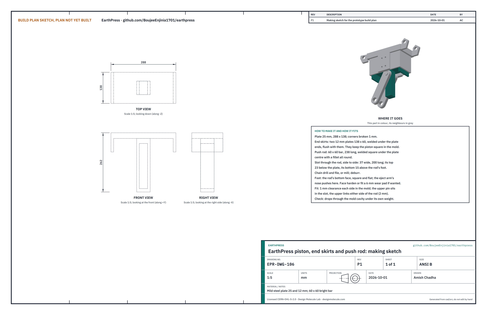

*Figure 9. Piston making sketch (EPR-DWG-106).*

**What it is and what it is made from.** The plate that presses the soil, with two end skirts that keep it square in the mold, on a square push rod slotted for the upper toggle pin. One welded piece of about 13 kg. Plate 25 and 12 mm, 60 x 60 bright bar.

**How to make it.**

1. Cut the plate, 25 mm, 288 x 138, and break its edges 1 mm.
2. Cut two skirts, 12 mm plate 138 x 60, and weld them under the plate's two short ends, flush with the ends.
3. Cut the push rod, 60 x 60 bar, 238 long. Cut the slot through it, side to side: 37 wide and 200 long, its top 23 below the plate and its bottom 15 above the rod's foot. Chain drill and file, or mill. Deburr.
4. Weld the rod square under the plate's centre, slot running across the press, with a fillet all round. Check it is square to the plate within 0.5 mm over its length.
5. Grind the rod's foot flat and square: the eject arm pushes on it.

**How it fits the parts next to it.**

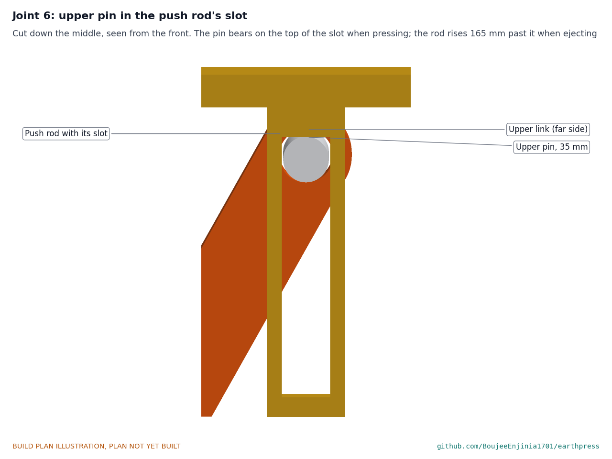

*Figure 10. Joint 6: the upper pin sits in the slot with the upper links either side of the rod; the pin pushes on the top of the slot when pressing, and the rod rises past it when ejecting.*

The piston has 1 mm clearance each side in the mold; the upper links pass 2 mm from the rod's sides.

**Check before moving on.** The piston drops through the mold cavity under its own weight in either direction.

### 3.5 Toggle links (make 4)

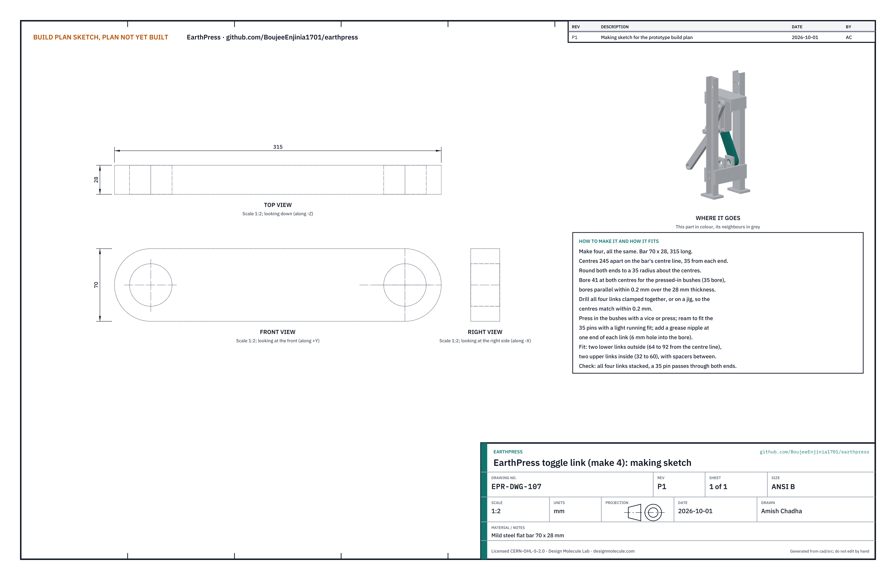

*Figure 11. Toggle link making sketch (EPR-DWG-107).*

**What it is and what it is made from.** The four links that straighten under the piston and multiply the lever's force. Mild steel flat bar 70 x 28, with pressed-in case-hardened bushes, 35 bore and 41 outside.

**How to make it.**

1. Cut four lengths of 70 x 28 bar, 315 long.
2. Clamp all four together, mark two centres 245 apart on the centre line, 35 from each end, and drill and bore 41 through all four at once, square to the faces.
3. Round both ends to a 35 radius about the centres.
4. Press a bush into each bore with a vice or press. Drill a 6 hole from the edge into one bore of each link and fit a grease nipple.
5. Ream the bushes to a light running fit on the 35 pins.
6. Cut or buy eight dust seal washers, 2 thick, 50 outside and 35.5 bore, from felt or rubber sheet (the toggle needs eight in all).

**How it fits the parts next to it.**

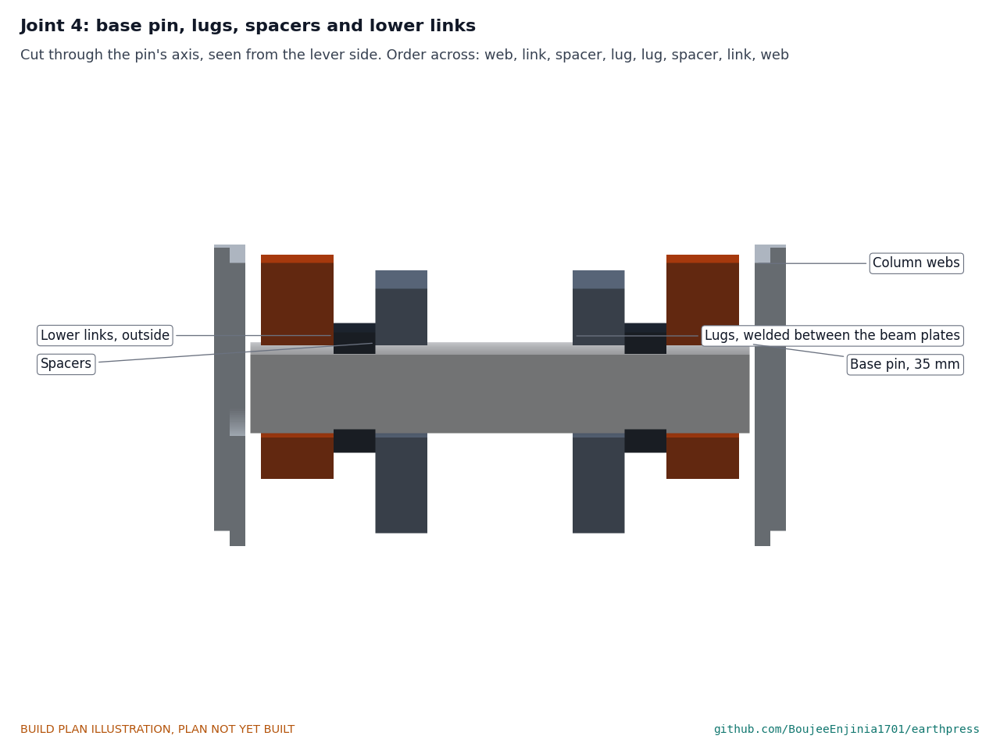

*Figure 12. Joint 4, cut through the pin: across the press the order is column web, lower link, spacer, lug, lug, spacer, lower link, column web.*

Two links are the lower links, outside, from 64 to 92 off the centre line; two are the upper links, inside, from 32 to 60.

**Check before moving on.** With all four links stacked, a 35 pin passes through both ends.

### 3.6 Connecting link

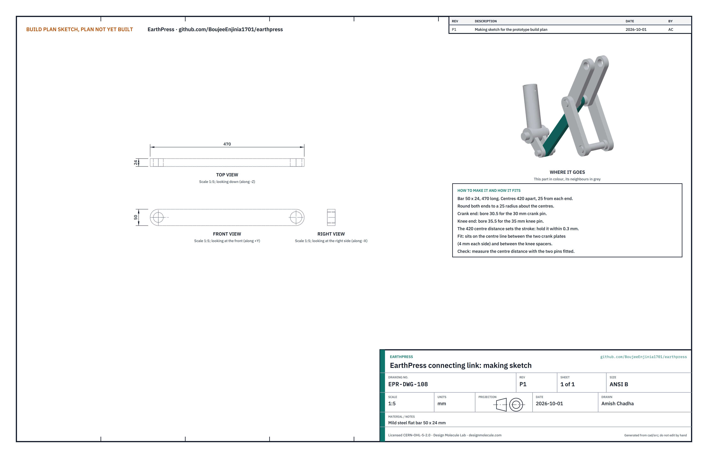

*Figure 13. Connecting link making sketch (EPR-DWG-108).*

**What it is and what it is made from.** The link from the crank on the lever hub to the toggle's knee. Mild steel flat bar 50 x 24.

**How to make it.**

1. Cut 470 long. Mark two centres 420 apart on the centre line, 25 from each end; hold 420 within 0.3, since it sets the stroke.
2. Bore 30.5 at the crank end and 35.5 at the knee end. Round both ends to a 25 radius.

**How it fits the parts next to it.**

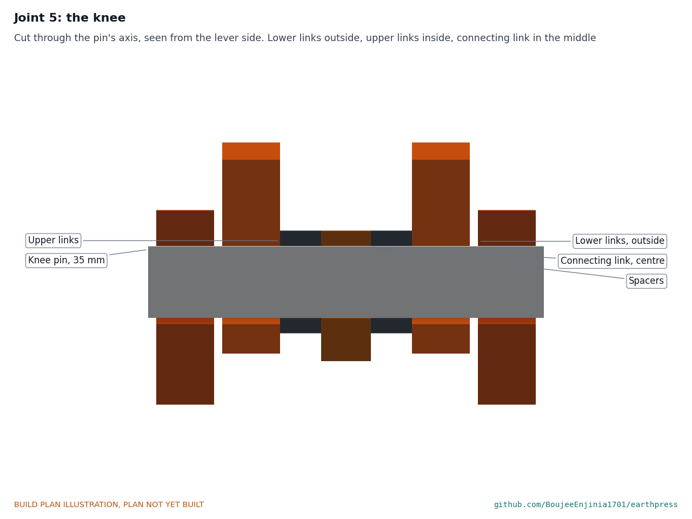

*Figure 14. Joint 5, cut through the knee pin: lower links outside, upper links inside, the connecting link in the middle between two spacers.*

At the crank end it sits on the centre line between the two crank plates, 4 mm from each.

**Check before moving on.** With both pins fitted, the centre distance is 420 within 0.3.

### 3.7 Lever hub, crank plates and socket

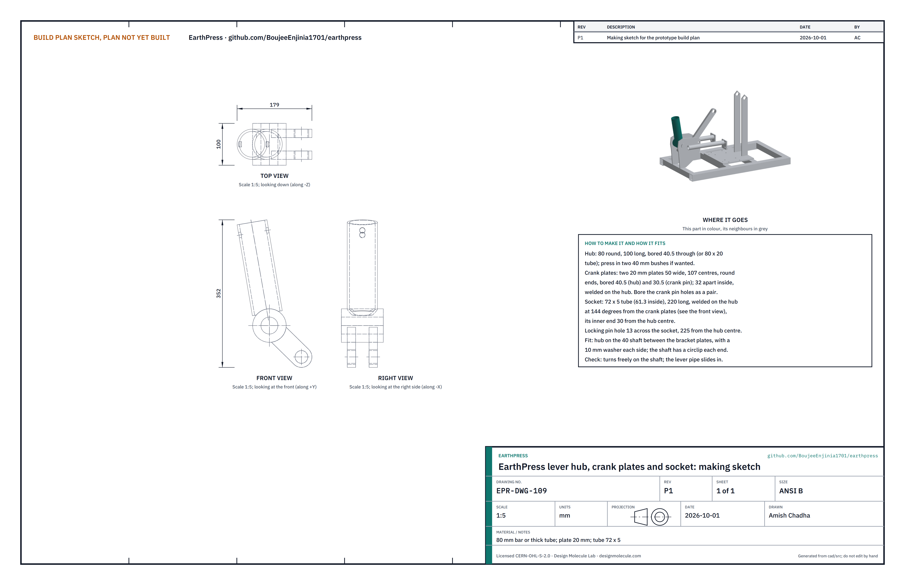

*Figure 15. Lever hub making sketch (EPR-DWG-109).*

**What it is and what it is made from.** The hub that turns on its shaft in the bracket, carrying the two crank plates and the socket for the lever. One welded piece. 80 round bar (or 80 x 20 thick tube), plate 20 mm, tube 72 x 5.

**How to make it.**

1. Cut the hub 100 long from 80 bar and bore it 40.5 through (or fit two 40 bore bushes).
2. Cut two crank plates from 20 mm plate, 50 wide with round ends, 107 between centres. Clamp them together and bore 40.5 (hub end) and 30.5 (crank pin end).
3. Slide the crank plates over a 40 bar through the hub, 32 apart inside, and weld them to the hub.
4. Cut the socket, 72 x 5 tube, 220 long. Weld it to the hub at 144° from the crank plates, measured as in Figure 15, its inner end 30 from the hub centre.
5. Drill a 13 hole across the socket, 225 from the hub centre, for the locking pin.

**How it fits the parts next to it.**

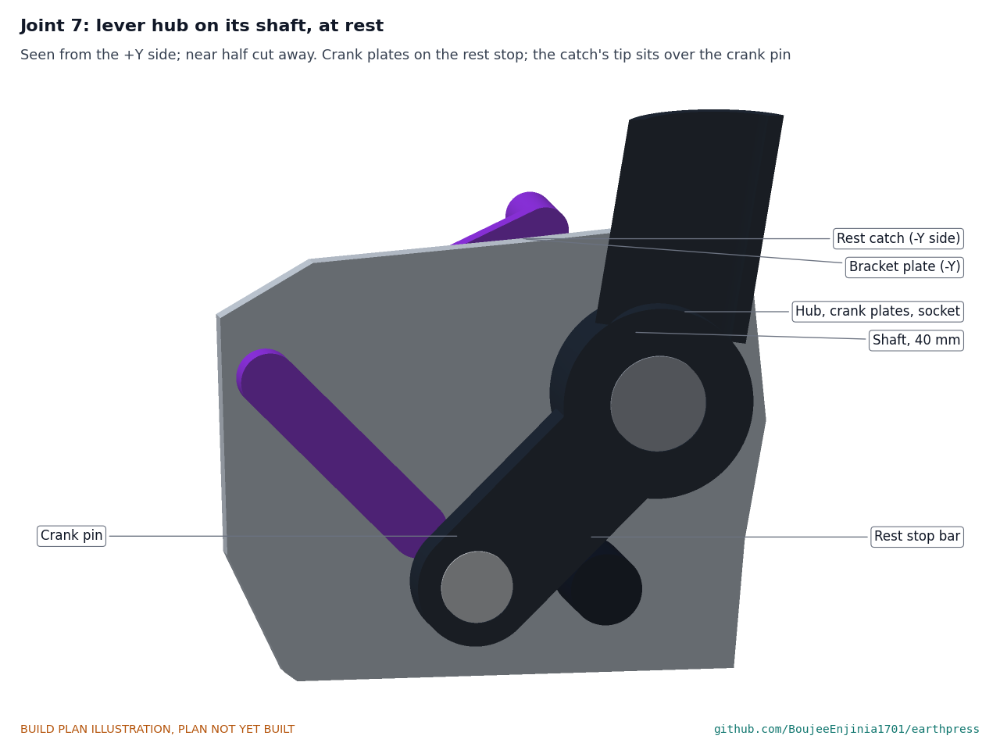

*Figure 16. Joint 7: the hub turns on the 40 shaft between the bracket plates, with a 10 mm washer each side; at rest the crank plates lie on the rest stop bar and the catch sits over the crank pin.*

**Check before moving on.** The hub turns freely on a 40 bar; the lever pipe slides into the socket.

### 3.8 Rest catch and end pawl (one of each)

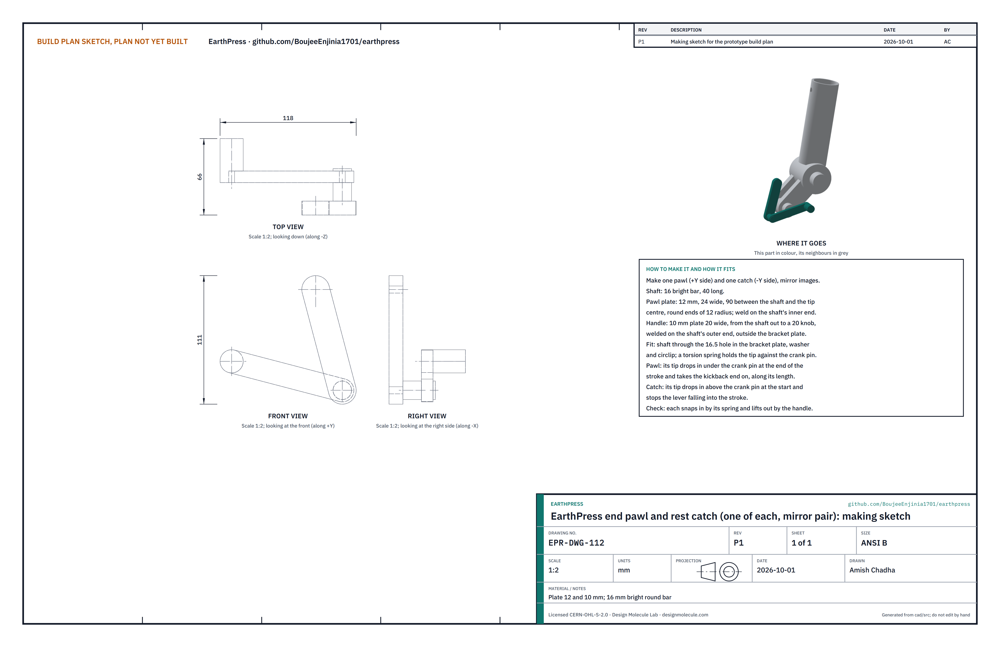

*Figure 17. End pawl and rest catch making sketch (EPR-DWG-112).*

**What it is and what it is made from.** Two spring pawls, mirror images, that catch the crank pin: the rest catch (on the -Y bracket plate) holds the lever at the start of the stroke, and the end pawl (on the +Y plate) holds it at the end. Plate 12 and 10 mm, 16 bright round bar.

**How to make it.**

1. For each: cut a 16 bar shaft 40 long; a pawl plate, 12 mm, 24 wide, with round ends of 12 radius and 90 between the shaft centre and the tip centre; and a handle plate, 10 mm, 20 wide, from the shaft to a 20 round knob.
2. Weld the pawl plate on one end of the shaft and, after fitting the shaft through its bracket plate, the handle on the other end, so the handle lies outside the bracket.
3. Round and smooth the tip; it slides on the crank pin.

**How it fits the parts next to it.**

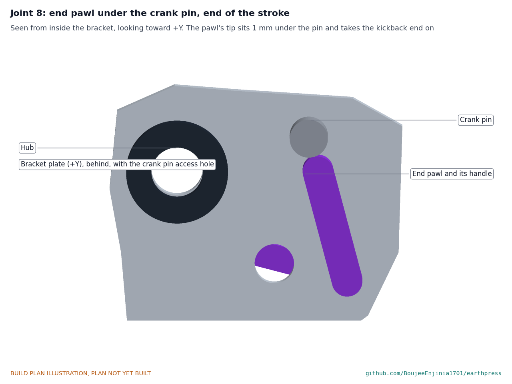

*Figure 18. Joint 8, at the end of the stroke: the pawl's tip sits 1 mm under the crank pin; if the lever is let go, the pin pushes the pawl end on, toward its shaft.*

A washer and circlip hold each shaft; a torsion spring holds the tip against the crank pin. The crank pin pushes each one aside as it passes; the catch drops in over the pin when the lever comes back to rest, and the pawl drops in under it at the end of the stroke.

**Check before moving on.** Each turns freely in its hole, snaps back on its spring and lifts clear with the handle.

### 3.9 Eject seesaw

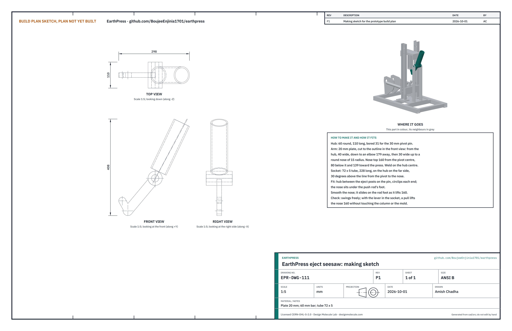

*Figure 19. Eject seesaw making sketch (EPR-DWG-111).*

**What it is and what it is made from.** The seesaw on the right of the press: the lever, moved into its socket, swings the arm's round nose up under the push rod's foot to lift the block out. One welded piece. Plate 20 mm, 60 round bar, tube 72 x 5.

**How to make it.**

1. Cut the hub 110 long from 60 bar and bore it 31.
2. Cut the arm from 20 mm plate to the outline in Figure 19: 40 wide from the hub down to the elbow, then 30 wide up to a round nose of 15 radius. The top of the nose is 160 from the hub centre, 80 below it and 139 toward the press.
3. Weld the arm on the middle of the hub. Weld the socket, 72 x 5 tube 228 long, on the hub on the far side, 30° above the line from the hub to the nose.
4. Smooth and round the nose.

**How it fits the parts next to it.**

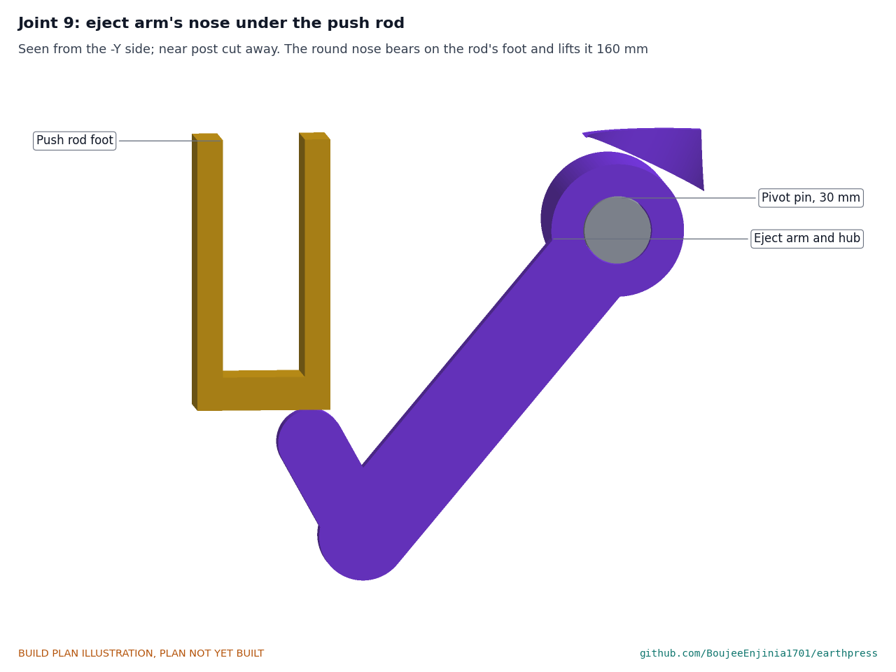

*Figure 20. Joint 9: the hub turns on a 30 pin between the eject posts; the round nose bears on the push rod's foot and slides on it as it lifts 160.*

**Check before moving on.** The seesaw swings freely on the pin.

### 3.10 Linkage guard

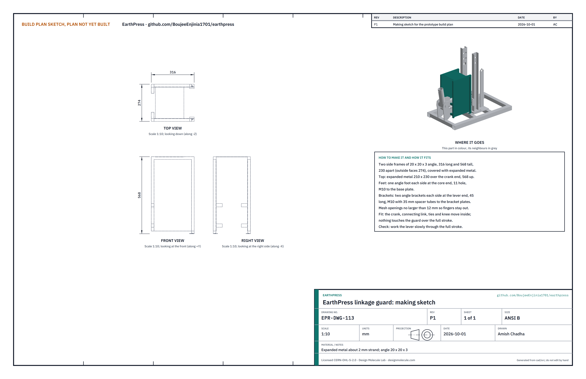

*Figure 21. Linkage guard making sketch (EPR-DWG-113).*

**What it is and what it is made from.** A cover over the crank, connecting link, ties and knee, so no hand can reach the scissor points. Expanded metal (about 2 mm strand, openings 12 mm or smaller) on a 20 x 20 x 3 angle frame.

**How to make it.**

1. Make two side frames of angle, 316 long and 568 tall, and join them at the top with angle so their outside faces are 274 apart.
2. Cover both sides, and the top over the left 210, with expanded metal; weld or bolt it to the frame.
3. Weld an angle foot with an 11 hole at the bottom right corner of each side, and two short angle brackets near the left end of each side, each with an 11 hole for an M10 bolt and a 35 mm spacer tube.

**How it fits the parts next to it.** The feet bolt to the base plate with M10; the brackets bolt to the bracket plates' outside faces with M10 through 35 mm spacers. Nothing that moves touches the guard over the full stroke.

**Check before moving on.** No opening larger than 12 mm; no sharp wire ends.

### 3.11 Lid with ribs and pin ears

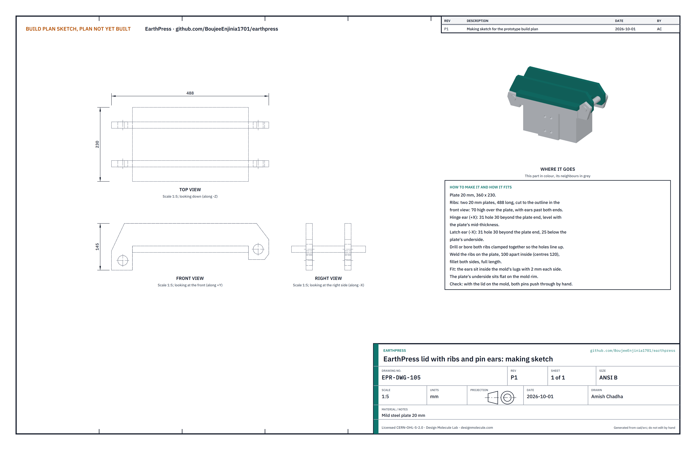

*Figure 22. Lid making sketch (EPR-DWG-105).*

**What it is and what it is made from.** The ribbed lid that closes the mold: its two ribs run past the plate at both ends as ears for the hinge pin and the latch pin. One welded piece of about 25 kg. Plate 20 mm.

**How to make it.**

1. Cut the plate, 20 mm, 360 x 230.
2. Cut the two ribs from 20 mm plate, 488 long, to the outline of Figure 22. Clamp them together and drill both 31 holes through both.
3. Weld the ribs on the plate's top face, 100 apart inside, with a fillet both sides full length, and a 30 bar through each pair of holes so they stay in line.

**How it fits the parts next to it.**

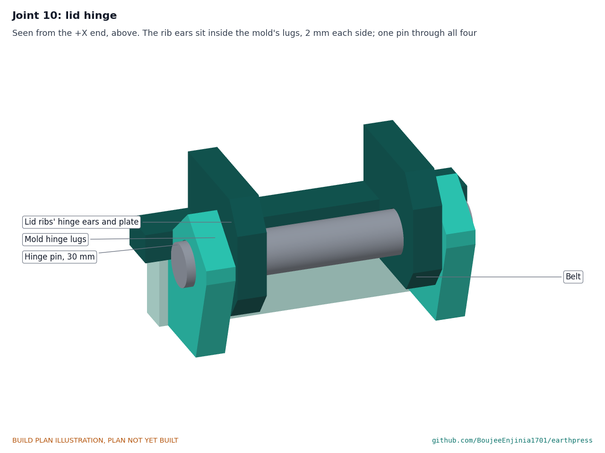

*Figure 23. Joint 10: the ears sit inside the mold's hinge lugs, 2 mm each side, on one 30 pin with circlips.*

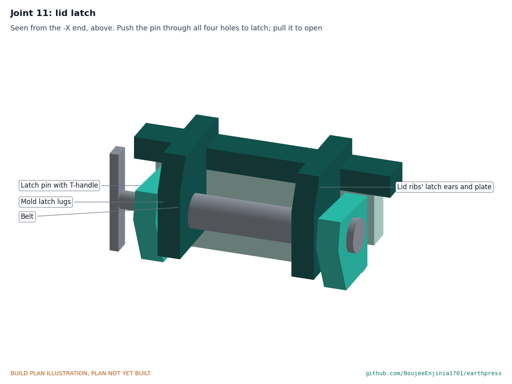

*Figure 24. Joint 11: to latch, push the 30 pin through the two lugs and the two ears; pull it out by its T-handle to open.*

**Check before moving on.** On the mold, the lid's underside sits flat on the rim and both pins push through by hand.

### 3.12 Lever pipe and T-handle

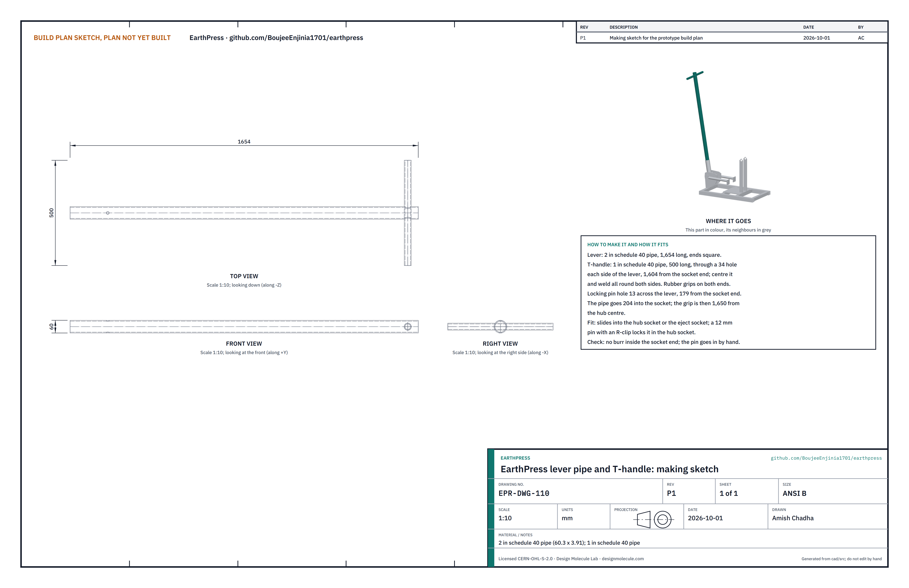

*Figure 25. Lever pipe making sketch (EPR-DWG-110).*

**What it is and what it is made from.** The removable lever with a T-handle so two people can pull together. 2 in schedule 40 pipe (60.3 x 3.91) and 1 in schedule 40 pipe.

**How to make it.**

1. Cut the lever 1,654 long, ends square and deburred inside.
2. Drill a 34 hole through both walls 1,604 from the socket end; pass a 500 length of 1 in pipe through, centre it and weld all round on both sides. Fit rubber grips on its ends.
3. Drill a 13 hole across the lever, 179 from the socket end, for the locking pin.

**How it fits the parts next to it.** The pipe goes 204 into the hub socket, where a 12 mm pin and R-clip lock it; the grip is then 1,650 from the hub centre. It also fits the eject socket.

**Check before moving on.** The pipe slides into both sockets; the locking pin goes in by hand.

### 3.13 Block gauge

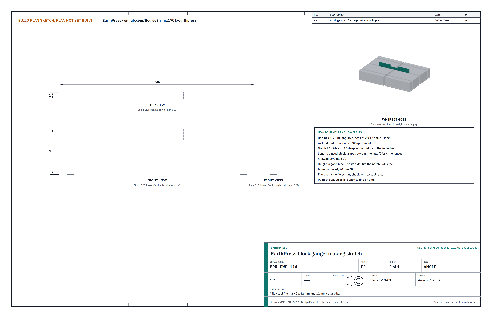

*Figure 26. Block gauge making sketch (EPR-DWG-114).*

**What it is and what it is made from.** A bar that checks every block for length and height. Flat bar 40 x 12 and 12 mm square bar.

**How to make it.** Cut the bar 340 long and two legs of 12 square bar 40 long; weld the legs under the ends, 292 apart inside. Cut a notch 93 wide and 20 deep in the middle of the top edge. File the inside faces flat and paint it.

**How it fits.** A good block drops between the legs (292, the longest allowed) and, on its side, into the notch (93, the tallest allowed).

**Check before moving on.** Measure 292 and 93 with a steel rule.

### 3.14 Soil sieve

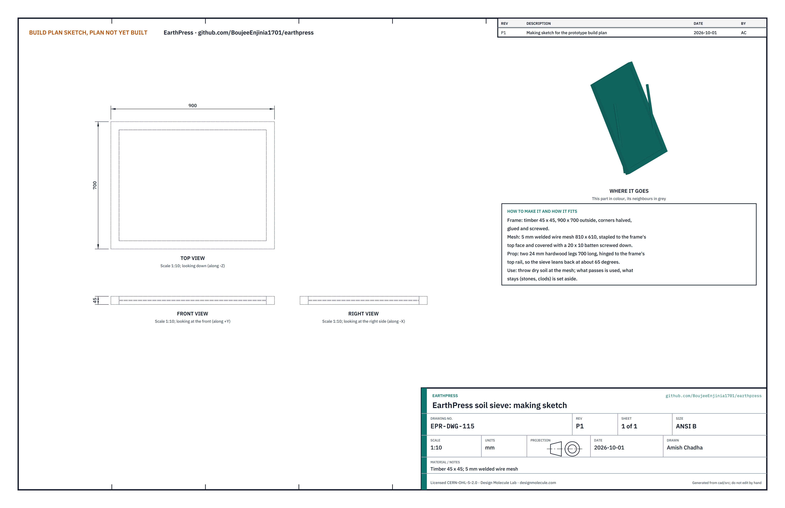

*Figure 27. Soil sieve making sketch (EPR-DWG-115).*

**What it is and what it is made from.** A screen that takes stones and clods out of the dug soil. Timber 45 x 45, 5 mm welded wire mesh, two 24 hardwood legs.

**How to make it.** Make a frame 900 x 700 outside with halved corners, glued and screwed. Staple the mesh to the top face and screw a 20 x 10 batten over its edges. Hinge two legs 700 long to the top rail so the sieve leans back at about 65°.

**Check before moving on.** The mesh is tight and has no torn wires.

### 3.15 Soil test kit: how to use it, with the operating chart and the lime chart

The kit (BOM line 9) tells you whether a soil can be used and how to fill the mold. The numbers below are calculated, not yet tested; the laminated chart in the kit repeats them, and they are redone for each soil once a partner's soils are measured.

**Choosing and mixing.** Sieve the soil through the 5 mm mesh. Run the jar test and the shrinkage box test as printed on the chart to see whether the soil is sandy, silty or clay-rich. Cement at 5 % of the dry soil mass is the default; lime is the option for clay-rich soils or where cement is scarce.

**Weighing every fill.** Weigh each fill of moist mix on the hanging scale: 7.64 kg is the nominal mass for the 290 x 140 x 90 mm block.

*Table 2. Operating chart for the design soil (the softer soil), two operators on the T-handle.*

| Fill over the nominal 7.64 kg | Result at the stop | Peak pull for each operator | What to do |
| --- | --- | --- | --- |
| Under 0 % (less than 7.64 kg) | Block under strength, under 2 MPa | Under 405 N | Add soil and weigh again |
| 0 % to +2 % (7.64 to 7.79 kg) | Good block, 90 mm high | 405 to 498 N | Press. The target is +1 % (7.72 kg), give or take 75 g |
| Over +2 % (more than 7.79 kg) | Operators stall short of the stop; block too tall and weak | Above 500 N | Take some soil out and weigh again |

The softest soil measured so far sets this chart: the pull peaks at 809 N in total, 405 N for each operator, which is under the 500 N limit. A stiffer soil needs less pull and gives a wider fill range, so the chart is safe for it; a still softer soil needs a new chart.

**The scoop rule.** A scoop may replace weighing only for a soil where its scatter has been measured. Weigh 20 scoops of the prepared mix. Accept the scoop only if the mass of one scoop varies by no more than 34 g either way as a typical spread (a standard deviation of 34 g or less) and the average is on the target of the chart. Test again for a new soil, a new moisture or a new scoop.

**Lime option, mix chart.** These are starting values from the calculation and common practice; they are to be confirmed by block strength tests before anyone relies on them.

*Table 3. Lime mix per block and per 100 blocks.*

| Item | Cement (default) | Lime (option) |
| --- | --- | --- |
| Share of the dry soil mass | 5 % | 8 % |
| Binder per block | 0.33 kg | 0.51 kg |
| Binder per 100 blocks | 33 kg | 51 kg |
| Water per block | 0.69 kg | 0.69 kg |
| Fill mass per block | 7.64 kg | 7.64 kg |
| Keep damp under cover | About 4 weeks | About 8 weeks |

Mix the lime dry into the sieved soil first, then add the water, and press the mix the same day. The press, its stroke and the dwell are the same for both binders. Blocks made with lime gain strength more slowly, so keep them damp under cover for the longer time before stacking them for use, and handle them gently for the first two weeks. Wear gloves and eye protection when mixing lime and cement.

### 3.16 Bought components

Buy to specification, not brand. Line numbers are those of the bill of materials.

- **Toggle pins (line 5).** Three C45 turned pins, 35 diameter, with a circlip groove near each end: two 192 long (base and knee) and one 128 long (upper).
- **Bushes and spacers (line 5).** Ten case-hardened steel bushes, 35 bore, 41 outside, 28 long (eight for the links, two for the lugs); two spacer tubes 50 x 35.5 inside, 16 long (base pin) and two 20 long (knee pin); six grease nipples; eight dust seal washers of felt or rubber, 2 thick, 50 outside and 35.5 bore.
- **Hub shaft and pins (lines 3, 6, 7).** One 40 shaft 154 long; one 30 crank pin 112 long; two 30 pins 196 long (hinge and latch, the latch pin with a welded T-handle); one 30 eject pin 152 long; all C45 with circlip grooves; one 12 locking pin with R-clip.
- **Springs (line 7).** Two small torsion springs for the catch and the pawl.
- **Fixings (line 11).** Eight M16 x 20 grade 8.8 hex bolts with washers; eight M12 x 40 and four M12 x 50 grade 8.8 bolts with nuts and washers; four M10 x 30 and four M10 x 50 bolts with nuts, and four 35 mm spacer tubes; ten 10 mm washers for the hub and seesaw; circlips for every pin.
- **Soil test kit (line 9).** Two 1 L clear jars with lids, a 600 x 40 x 40 shrinkage box, three measuring buckets, a 10 kg hanging scale with 50 g divisions, salt and the laminated test chart.
- **Finish (line 11).** Primer and paint for all steel except the mold cavity, the pins and the bushes.

## 4. Putting it together

In each picture the parts already fitted are grey and the part being fitted is in colour, with an arrow showing the way it goes in. Grease every pin and bush as it goes in.

### Step 1: set the base frame level

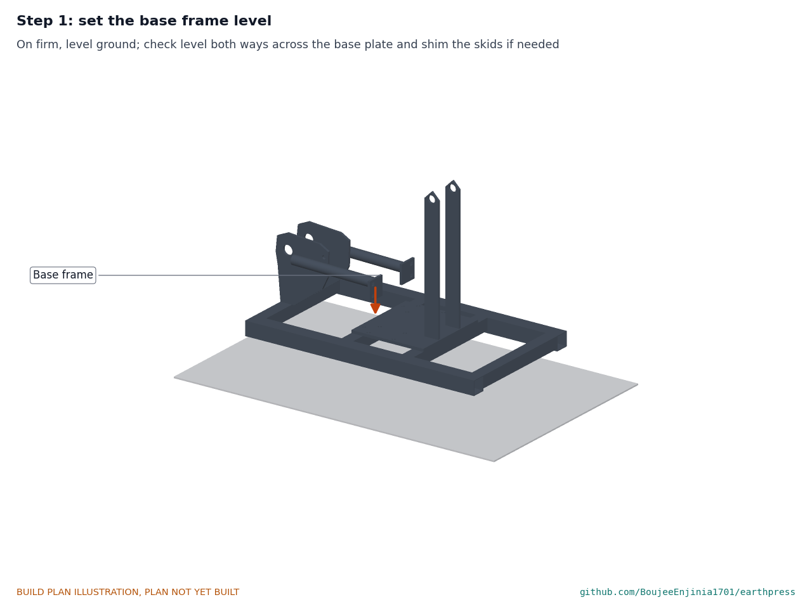

On firm, level ground. Check level both ways across the base plate and shim under the skids if needed.

### Step 2: press core onto the base plate

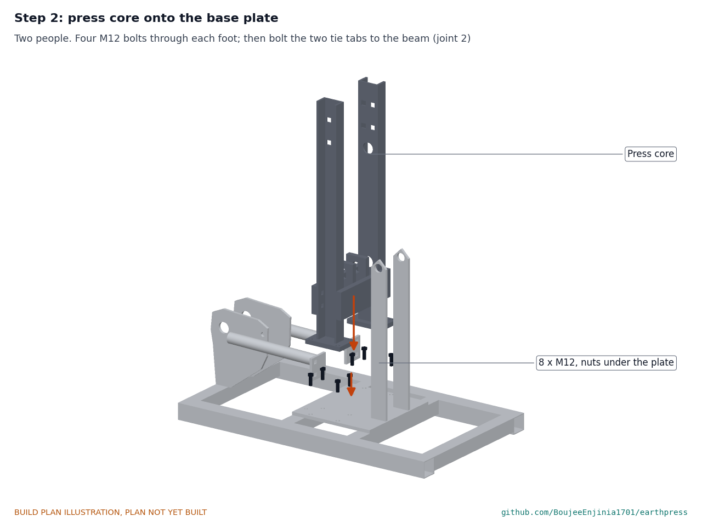

Two people lift the core (28 kg) onto the base plate. Four M12 bolts through each foot, nuts under the plate, tight. Bolt the two tie tabs to the beam with two M12 each (Figure 6).

### Step 3: mold box between the columns

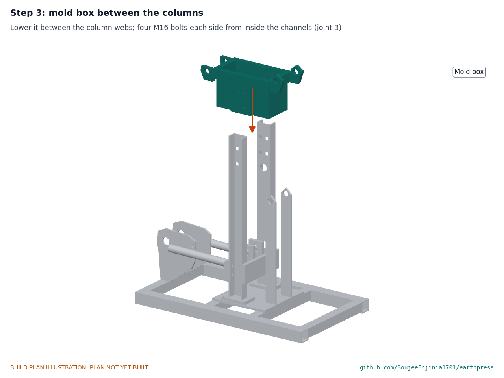

Two people lower the mold (30 kg) between the column webs from above until the bolt holes line up; a helper holds it while the first bolts go in. Four M16 bolts each side from inside the channels, tight. **Hold point:** the rim is level both ways.

### Step 4: piston into the mold from the top

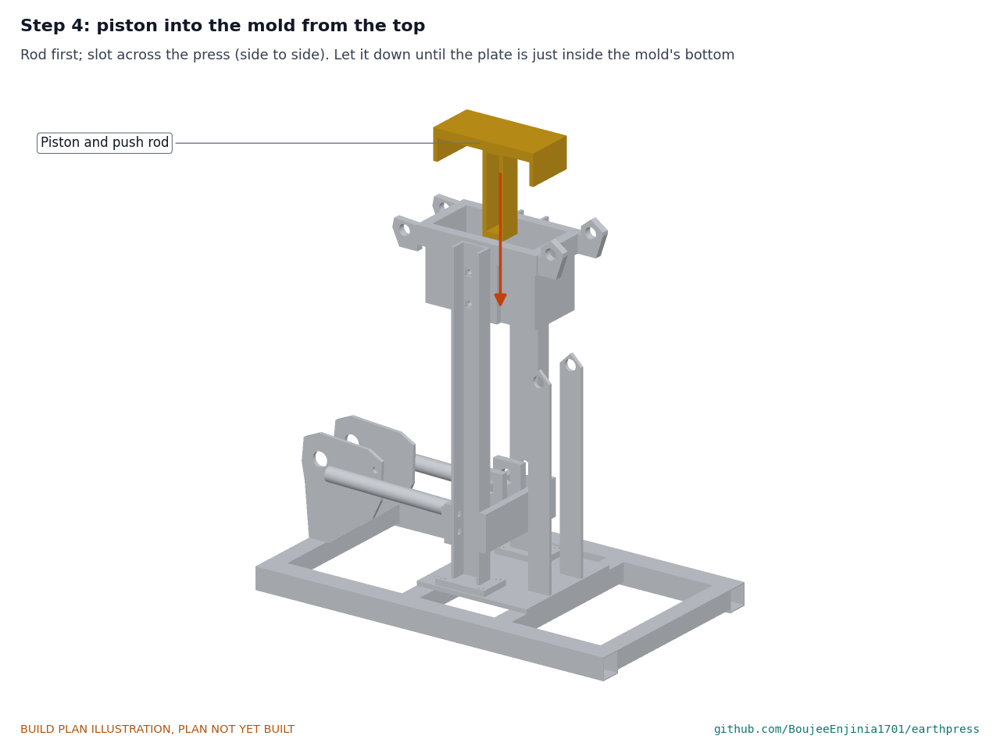

Rod first, with the slot running across the press. Let it down until the plate is just inside the mold's lower edge and hold it there with a wooden prop under the rod.

### Step 5: lower links on the base pin

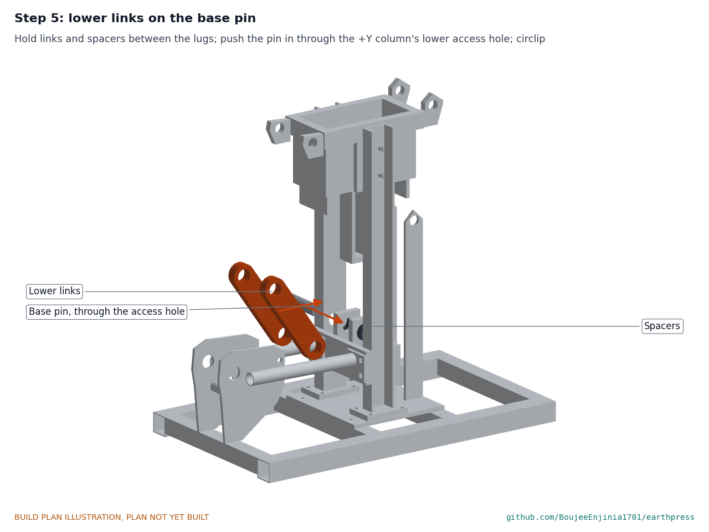

Hold the two lower links and two spacers between the lugs and push the base pin in from the +Y side through the column's lower access hole. Fit a dust seal washer on the pin against each outer link face. Circlips on both ends.

### Step 6: the knee

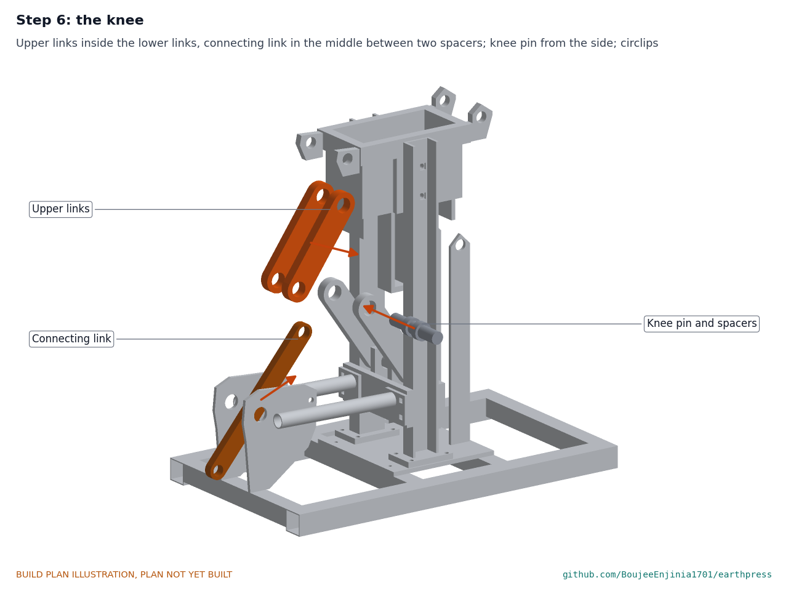

Put the upper links inside the lower links' free ends, the connecting link in the middle between the two knee spacers, and push the knee pin through from the side. Fit a dust seal washer against each outer link face before the circlips. Circlips.

### Step 7: upper pin through the rod's slot

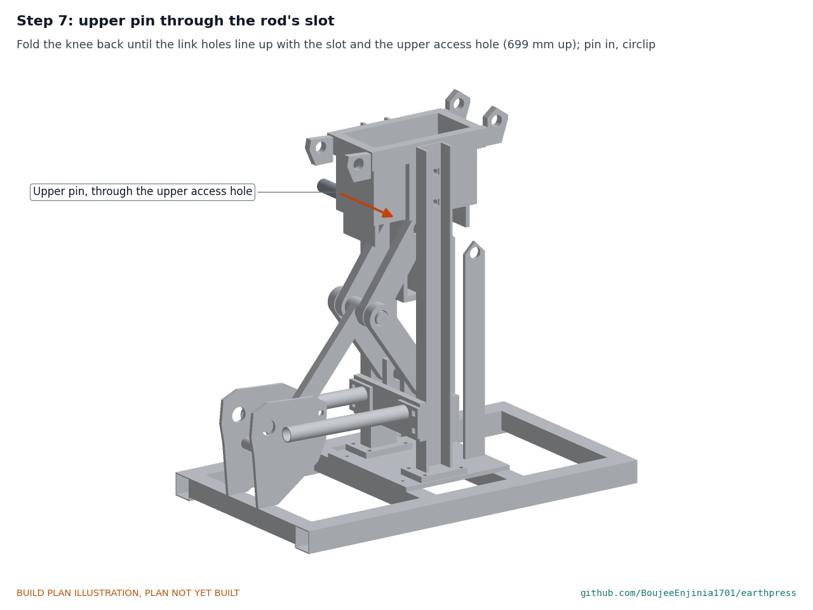

Fold the knee back until the upper links' holes line up with the rod's slot and the column's upper access hole (699 above the ground); move the piston's prop to suit. Push the upper pin in through the access hole, the links and the slot. Fit a dust seal washer against each outer upper link face. Circlips. Take out the prop.

### Step 8: lever hub on its shaft; crank pin

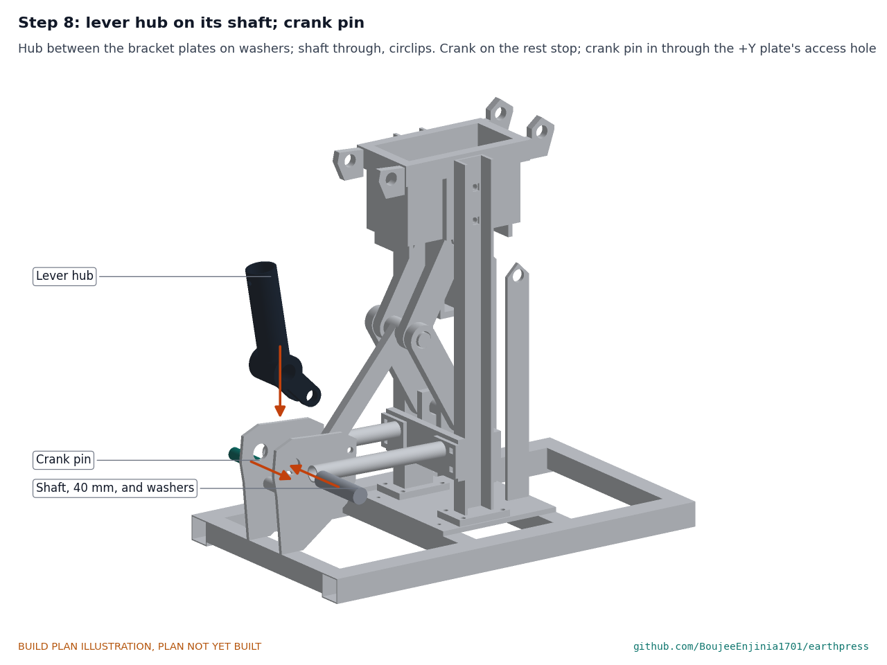

Seen from behind. Hold the hub between the bracket plates with a 10 mm washer each side and push the shaft through; circlips. Swing the crank to the connecting link's free end, with the crank plates on the rest stop, and push the crank pin in through the access hole in the +Y bracket plate, the crank plates and the link. Circlips.

### Step 9: rest catch and end pawl

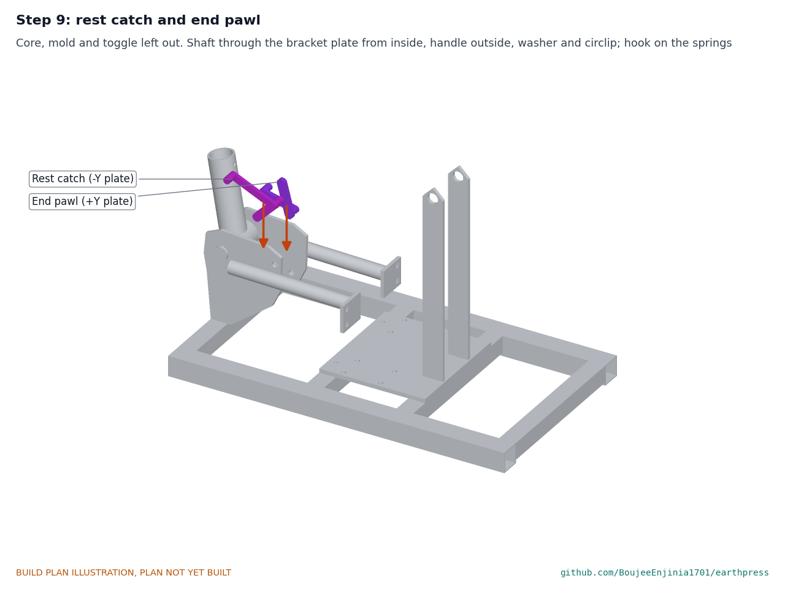

Fit each shaft through its bracket plate from the inside, with a washer; weld or bolt on the handle outside; circlip; hook on the spring. The catch goes on the -Y plate, the pawl on the +Y plate.

### Step 10: eject seesaw between the posts

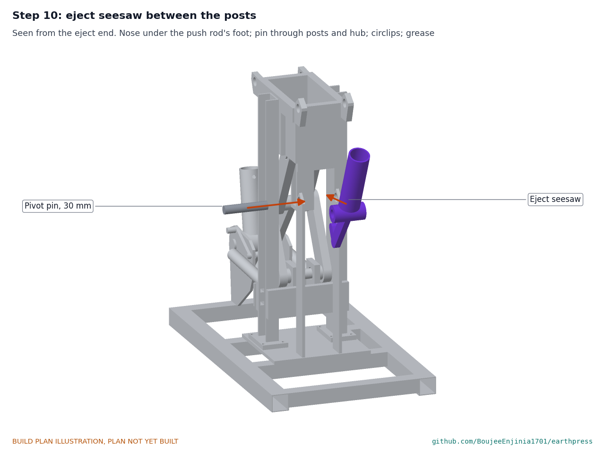

Hold the seesaw between the posts with a washer each side, nose under the push rod's foot, and push the pivot pin through. Circlips.

### Step 11: linkage guard

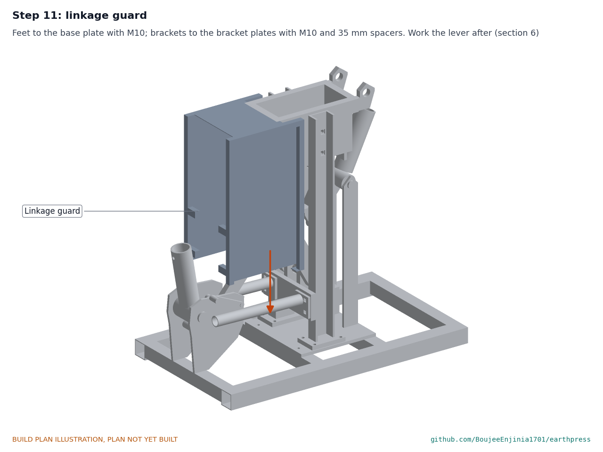

Seen from behind. Feet to the base plate with M10 bolts; brackets to the bracket plates with M10 bolts through the 35 mm spacers. **Hold point:** safety stop S2 in section 6.

### Step 12: lid, hinge pin and latch pin

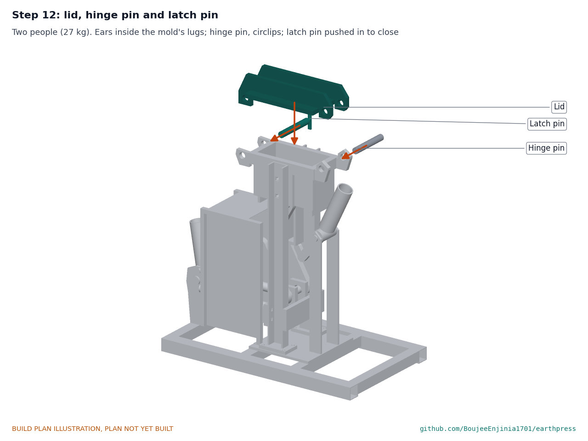

Two people lift the lid (27 kg) onto the mold with its ears inside the mold's lugs. Hinge pin through, circlips. Close the lid and push the latch pin through.

### Step 13: lever into the hub socket

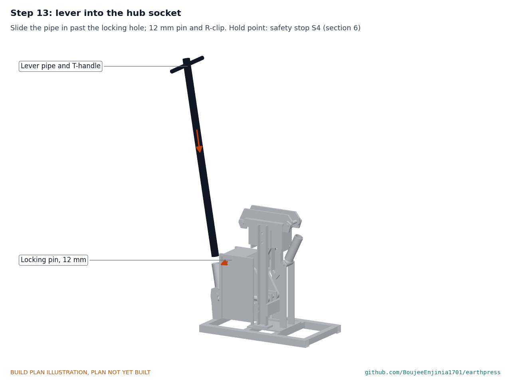

Slide the pipe into the hub socket past the locking hole; fit the 12 mm pin and R-clip. **Hold point:** safety stop S4 in section 6.

## 5. First checks

These are the checks a TRL 4 test report would record; this plan only lists them. Requirement numbers are those of EPR-REQ-001.

*Table 4. First checks.*

| Check | Requirement | How | Pass when |
| --- | --- | --- | --- |
| Cavity size | R1 | Measure the cavity at top and bottom | 290 x 140 within 1 mm, square |
| Free stroke, mold empty | R2, R12 | Lid open, lift the catch, take the lever slowly through the full stroke and back | Nothing binds or touches; the pawl drops in at the end and the catch at the start; the piston rises 60 mm |
| Clearances | R12 | Watch the crank, connecting link, knee and eject arm through the stroke | Nothing touches the guard, the ties or the frame |
| Lid and latch | R12 | Close the lid; push the latch pin in and out | Pin goes in by hand; the lid sits flat on the rim |
| Ejection, mold empty | R5 | Lever in the eject socket; pull down | The piston face rises to 10 mm above the rim; pull under 100 N with no block |
| Grip heights | R5 | Measure the T-handle at the start and the end of the stroke | About 1.89 m and 0.86 m above the ground |
| First block | R1, R2 | Weigh the fill to the chart's target, press with two people to the stop, eject | Block comes out whole; height 90 within 3 mm on the gauge |
| Pull force | R5 | Spring balance on the T-handle on a test block | 1,000 N or less in total at the peak; record it |
| Kickback | R12 | At the end of a press, let go with the pawl engaged | The lever stays at the end; the pawl takes the load |
| Mass of each piece | R7 | Weigh each piece on a platform scale | 50 kg or less each; record the total |
| Cycle time | R4 | Time ten blocks with a crew of four | Record it; 85 s or less is the target |

## 6. Safety stops

Stop at each point. Carry on only when everything listed is true.

- **S1. Before any welding or cutting.** Welding helmet, gloves, leather apron and safety glasses on; fire extinguisher within reach; nothing that burns within 10 m; the grinder has its guard.
- **S2. Before the lever is fitted.** Every bolt is tight; every pin has a circlip at each end; the guard is in place; nothing moves by hand except the toggle, hub, catch, pawl and seesaw.
- **S3. Before anyone lifts a piece.** Two people for every piece over 25 kg (base frame, core, mold, lid); gloves and safety boots.
- **S4. Before the first stroke.** The lid is either open with the mold empty, or closed and latched; two people on the T-handle; everyone else 2 m clear; no hands near the mold, the linkage or the eject arm; the catch and the pawl work (section 5).
- **S5. Before the first block.** Gloves, long sleeves, eye protection and an FFP2 or N95 respirator for mixing cement and sieving soil; sieve damp soil where possible.
- **S6. At every stroke.** Engage the pawl before letting go at the end; hold the lever while lifting the pawl and walk it back to rest; never open the latch until the lever is back on its rest stop with the catch in.

## 7. Tools, skills and workspace

**Tools.** Stick welder (about 160 A) with rods for mild steel; angle grinder with cutting, grinding and flap discs; plasma or oxy-fuel cutter for the shaped plates (or a band saw and patience); drill press with drills to 18 and a 40 or 41 bore (or a holesaw and a boring bar, or bought bored parts); M16 tap and tap wrench; set of files; clamps and a flat welding table about 1.2 x 0.6 m; square, rule, calipers and a 1 m straightedge; spirit level; socket set to 24 mm; circlip pliers; vice or small press for the bushes; a 35 reamer; spring balance to 100 kg; platform scale to 50 kg; stopwatch.

**Skills.** A competent welder for structural fillet welds in 10 to 20 mm plate; basic machine-shop work (drilling, tapping, pressing in bushes). The turned pins, shaft and bushes are bought from a machine or bearing shop. No electrical work is part of this build.

**Workspace.** A workshop floor at least 3 x 3 m; a flat table for tacking the frames square; a clear 2 m zone round the press for the first strokes.

**Personal protective equipment.** Welding helmet, gloves and apron; safety glasses and hearing protection for grinding; safety boots; for using the press, gloves, eye protection and a respirator for cement and dry soil.

## 8. Where the numbers come from

- Model and constructability checks: `cad/src/model.py` (`python cad/src/model.py --check`); STEP and STL exports in `cad/step/` and `cad/stl/`.
- Pictures: `cad/src/build_plan_media.py`, using `.kit/build_views.py`; written to `docs/05-build-plan/` and `cad/drawings/EPR-DWG-101` to `EPR-DWG-115`.
- General arrangement: `cad/drawings/EPR-DWG-001.pdf`, Rev P3.
- Calculations: `docs/04-calcs/01-sizing.md` (EPR-CAL-001 v0.6) and `docs/04-calcs/sizing.py`; forces and grip heights section 4, structure section 6, ejection section 7, mass section 8; operating chart section 4b and lime chart section 4c of `sizing.py`.
- Bill of materials: `bom/bom.csv`.
- Decisions: `docs/decisions/0003-design-for-construction.md` (EPR-DDR-003), with EPR-DDR-001 and EPR-DDR-002; `docs/06-design-decisions.md` (EPR-DEC-001).
- Requirements: `docs/03-requirements.md` (EPR-REQ-001 v0.8).
